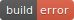

docker-debian-releases
======================

This repository creates docker images of Debian-based system using
debootstrap, for various architectures, and uploads them
to [docker hub](https://hub.docker.com/r/lpenz/) using travis.

The status of each combination is in the tables below:
- [Debian](#Debian)
- [Devuan](#Devuan)
- [Raspbian](#Raspbian)
- [Tanglu](#Tanglu)
- [Ubuntu](#Ubuntu)

## Organization

To avoid having to track the combinations of each distribution and
architecture manually, this repository gets the parameters of
debootstrap from the current branch name, and then scraps a list of
mirrors to figure out which ones to use. That way, to support a new
release, we have to simply push a new remote branch on top of HEAD.
The following scripts are in charge of this mechanism:
- [docker-create-debian-image](docker-create-debian-image): shell
  script that creates a docker image for a specific Debian or Ubuntu
  release, architecture and debootstrap variant.
- [travis-script.sh](travis-script.sh): script that transform a
  travis-ci environment into a call to docker-create-debian-image.

The README.md file (aka this file) is created offline, from
information obtained from scrapping all available mirrors and
travis-ci itself. The following scripts are in charge of this process:
- [apt-mirror-info](go/cmd/apt-mirror-info/main.go): scraps Debian
  and Ubuntu repositories and outputs a json with information about
  all releases it can find.
- [json-tmpl-render](go/cmd/json-tmpl-render/main.go): renders a
  template file with information from a json file.
- [travis-branch-jobs](go/cmd/travis-branch-jobs/main.go): scraps the
  build information form this repository form travis-ci, for all
  branches that corresponds to relases.
- [README.md.tmpl](README.md.tmpl): template for README.md that uses
  the information obtained by apt-mirror-info and travis-branch-jobs
  to create a table of images and status' with links to jobs.
- [SConstruct](SConstruct): scons script that builds the go sources
  and README.md.

Besides image building and deploying to
[docker hub](https://hub.docker.com), the [.travis.yml](.travis.yml)
file also performs static analysis, builds go sources and checks if
the README.md file is up-to-date.

## Image status

The tables below detail the result of the latest build attempt, and
links to the image in [docker hub](https://hub.docker.com/r/lpenz/) if
the build was successful.

The errors reported below are usually caused by:
- lack of support in qemu for the architecture;
- timeout when building the standard image (that's why minbase is also built);
- incompatibility with modern linux kernel.

### Debian

<table>
<thead>
<tr><th rowspan="2">Release</th><th rowspan="2">Version</th><th rowspan="2">Arch</th><th colspan="2">Variant status</th></tr>
<tr><th>standard</th><th>minbase</th></tr>
</thead>
<tbody>
<tr>
    <td>potato</td><td>2.2r7</td><td>alpha</td>
    <td>
        
    </td>
    <td>
        
    </td>
</tr>
<tr>
    <td>potato</td><td>2.2r7</td><td>arm</td>
    <td>
        
    </td>
    <td>
        
    </td>
</tr>
<tr>
    <td>potato</td><td>2.2r7</td><td>i386</td>
    <td>
        
    </td>
    <td>
        
    </td>
</tr>
<tr>
    <td>potato</td><td>2.2r7</td><td>m68k</td>
    <td>
        
    </td>
    <td>
        
    </td>
</tr>
<tr>
    <td>potato</td><td>2.2r7</td><td>powerpc</td>
    <td>
        
    </td>
    <td>
        
    </td>
</tr>
<tr>
    <td>potato</td><td>2.2r7</td><td>sparc</td>
    <td>
        
    </td>
    <td>
        
    </td>
</tr>
<tr>
    <td>woody</td><td>3.0r6</td><td>alpha</td>
    <td>
        
    </td>
    <td>
        
    </td>
</tr>
<tr>
    <td>woody</td><td>3.0r6</td><td>arm</td>
    <td>
        
    </td>
    <td>
        
    </td>
</tr>
<tr>
    <td>woody</td><td>3.0r6</td><td>hppa</td>
    <td>
        
    </td>
    <td>
        
    </td>
</tr>
<tr>
    <td>woody</td><td>3.0r6</td><td>i386</td>
    <td>
        
    </td>
    <td>
        
    </td>
</tr>
<tr>
    <td>woody</td><td>3.0r6</td><td>ia64</td>
    <td>
        
    </td>
    <td>
        
    </td>
</tr>
<tr>
    <td>woody</td><td>3.0r6</td><td>m68k</td>
    <td>
        
    </td>
    <td>
        
    </td>
</tr>
<tr>
    <td>woody</td><td>3.0r6</td><td>mips</td>
    <td>
        
    </td>
    <td>
        
    </td>
</tr>
<tr>
    <td>woody</td><td>3.0r6</td><td>mipsel</td>
    <td>
        
    </td>
    <td>
        
    </td>
</tr>
<tr>
    <td>woody</td><td>3.0r6</td><td>powerpc</td>
    <td>
        
    </td>
    <td>
        
    </td>
</tr>
<tr>
    <td>woody</td><td>3.0r6</td><td>s390</td>
    <td>
        
    </td>
    <td>
        
    </td>
</tr>
<tr>
    <td>woody</td><td>3.0r6</td><td>sparc</td>
    <td>
        
    </td>
    <td>
        
    </td>
</tr>
<tr>
    <td>sarge</td><td>3.1r8</td><td>alpha</td>
    <td>
        
    </td>
    <td>
        
    </td>
</tr>
<tr>
    <td>sarge</td><td>3.1r8</td><td>arm</td>
    <td>
        
    </td>
    <td>
        
    </td>
</tr>
<tr>
    <td>sarge</td><td>3.1r8</td><td>hppa</td>
    <td>
        
    </td>
    <td>
        
    </td>
</tr>
<tr>
    <td>sarge</td><td>3.1r8</td><td>i386</td>
    <td>
        
    </td>
    <td>
        
    </td>
</tr>
<tr>
    <td>sarge</td><td>3.1r8</td><td>ia64</td>
    <td>
        
    </td>
    <td>
        
    </td>
</tr>
<tr>
    <td>sarge</td><td>3.1r8</td><td>m68k</td>
    <td>
        
    </td>
    <td>
        
    </td>
</tr>
<tr>
    <td>sarge</td><td>3.1r8</td><td>mips</td>
    <td>
        
    </td>
    <td>
        
    </td>
</tr>
<tr>
    <td>sarge</td><td>3.1r8</td><td>mipsel</td>
    <td>
        
    </td>
    <td>
        
    </td>
</tr>
<tr>
    <td>sarge</td><td>3.1r8</td><td>powerpc</td>
    <td>
        
    </td>
    <td>
        
    </td>
</tr>
<tr>
    <td>sarge</td><td>3.1r8</td><td>s390</td>
    <td>
        
    </td>
    <td>
        
    </td>
</tr>
<tr>
    <td>sarge</td><td>3.1r8</td><td>sparc</td>
    <td>
        
    </td>
    <td>
        
    </td>
</tr>
<tr>
    <td>etch</td><td>4.0r9</td><td>alpha</td>
    <td>
        
    </td>
    <td>
        
    </td>
</tr>
<tr>
    <td>etch</td><td>4.0r9</td><td>amd64</td>
    <td>
        
    </td>
    <td>
        
    </td>
</tr>
<tr>
    <td>etch</td><td>4.0r9</td><td>arm</td>
    <td>
        
    </td>
    <td>
        
    </td>
</tr>
<tr>
    <td>etch</td><td>4.0r9</td><td>hppa</td>
    <td>
        
    </td>
    <td>
        
    </td>
</tr>
<tr>
    <td>etch</td><td>4.0r9</td><td>i386</td>
    <td>
        
    </td>
    <td>
        
    </td>
</tr>
<tr>
    <td>etch</td><td>4.0r9</td><td>ia64</td>
    <td>
        
    </td>
    <td>
        
    </td>
</tr>
<tr>
    <td>etch</td><td>4.0r9</td><td>mips</td>
    <td>
        
    </td>
    <td>
        
    </td>
</tr>
<tr>
    <td>etch</td><td>4.0r9</td><td>mipsel</td>
    <td>
        
    </td>
    <td>
        
    </td>
</tr>
<tr>
    <td>etch</td><td>4.0r9</td><td>powerpc</td>
    <td>
        
    </td>
    <td>
        
    </td>
</tr>
<tr>
    <td>etch</td><td>4.0r9</td><td>s390</td>
    <td>
        
    </td>
    <td>
        
    </td>
</tr>
<tr>
    <td>etch</td><td>4.0r9</td><td>sparc</td>
    <td>
        
    </td>
    <td>
        
    </td>
</tr>
<tr>
    <td>lenny</td><td>5.0.10</td><td>alpha</td>
    <td>
        
    </td>
    <td>
        
    </td>
</tr>
<tr>
    <td>lenny</td><td>5.0.10</td><td>amd64</td>
    <td>
        
    </td>
    <td>
        
    </td>
</tr>
<tr>
    <td>lenny</td><td>5.0.10</td><td>arm</td>
    <td>
        
    </td>
    <td>
        
    </td>
</tr>
<tr>
    <td>lenny</td><td>5.0.10</td><td>armel</td>
    <td>
        
    </td>
    <td>
        
    </td>
</tr>
<tr>
    <td>lenny</td><td>5.0.10</td><td>hppa</td>
    <td>
        
    </td>
    <td>
        
    </td>
</tr>
<tr>
    <td>lenny</td><td>5.0.10</td><td>i386</td>
    <td>
        
    </td>
    <td>
        
    </td>
</tr>
<tr>
    <td>lenny</td><td>5.0.10</td><td>ia64</td>
    <td>
        
    </td>
    <td>
        
    </td>
</tr>
<tr>
    <td>lenny</td><td>5.0.10</td><td>mips</td>
    <td>
        
    </td>
    <td>
        
    </td>
</tr>
<tr>
    <td>lenny</td><td>5.0.10</td><td>mipsel</td>
    <td>
        
    </td>
    <td>
        
    </td>
</tr>
<tr>
    <td>lenny</td><td>5.0.10</td><td>powerpc</td>
    <td>
        
    </td>
    <td>
        
    </td>
</tr>
<tr>
    <td>lenny</td><td>5.0.10</td><td>s390</td>
    <td>
        
    </td>
    <td>
        
    </td>
</tr>
<tr>
    <td>lenny</td><td>5.0.10</td><td>sparc</td>
    <td>
        
    </td>
    <td>
        
    </td>
</tr>
<tr>
    <td>squeeze</td><td>6.0.10</td><td>amd64</td>
    <td>
        
    </td>
    <td>
        
    </td>
</tr>
<tr>
    <td>squeeze</td><td>6.0.10</td><td>armel</td>
    <td>
        
    </td>
    <td>
        
    </td>
</tr>
<tr>
    <td>squeeze</td><td>6.0.10</td><td>i386</td>
    <td>
        
    </td>
    <td>
        
    </td>
</tr>
<tr>
    <td>squeeze</td><td>6.0.10</td><td>ia64</td>
    <td>
        
    </td>
    <td>
        
    </td>
</tr>
<tr>
    <td>squeeze</td><td>6.0.10</td><td>mips</td>
    <td>
        
    </td>
    <td>
        
    </td>
</tr>
<tr>
    <td>squeeze</td><td>6.0.10</td><td>mipsel</td>
    <td>
        
    </td>
    <td>
        
    </td>
</tr>
<tr>
    <td>squeeze</td><td>6.0.10</td><td>powerpc</td>
    <td>
        
    </td>
    <td>
        
    </td>
</tr>
<tr>
    <td>squeeze</td><td>6.0.10</td><td>s390</td>
    <td>
        
    </td>
    <td>
        
    </td>
</tr>
<tr>
    <td>squeeze</td><td>6.0.10</td><td>sparc</td>
    <td>
        
    </td>
    <td>
        
    </td>
</tr>
<tr>
    <td>wheezy</td><td>7.11</td><td>amd64</td>
    <td>
        
    </td>
    <td>
        
    </td>
</tr>
<tr>
    <td>wheezy</td><td>7.11</td><td>armel</td>
    <td>
        
    </td>
    <td>
        
    </td>
</tr>
<tr>
    <td>wheezy</td><td>7.11</td><td>armhf</td>
    <td>
        
    </td>
    <td>
        
    </td>
</tr>
<tr>
    <td>wheezy</td><td>7.11</td><td>i386</td>
    <td>
        
    </td>
    <td>
        
    </td>
</tr>
<tr>
    <td>wheezy</td><td>7.11</td><td>ia64</td>
    <td>
        
    </td>
    <td>
        
    </td>
</tr>
<tr>
    <td>wheezy</td><td>7.11</td><td>mips</td>
    <td>
        
    </td>
    <td>
        
    </td>
</tr>
<tr>
    <td>wheezy</td><td>7.11</td><td>mipsel</td>
    <td>
        
    </td>
    <td>
        
    </td>
</tr>
<tr>
    <td>wheezy</td><td>7.11</td><td>powerpc</td>
    <td>
        
    </td>
    <td>
        
    </td>
</tr>
<tr>
    <td>wheezy</td><td>7.11</td><td>s390</td>
    <td>
        
    </td>
    <td>
        
    </td>
</tr>
<tr>
    <td>wheezy</td><td>7.11</td><td>s390x</td>
    <td>
        
    </td>
    <td>
        
    </td>
</tr>
<tr>
    <td>wheezy</td><td>7.11</td><td>sparc</td>
    <td>
        
    </td>
    <td>
        
    </td>
</tr>
<tr>
    <td>jessie</td><td>8.11</td><td>amd64</td>
    <td>
        
    </td>
    <td>
        
    </td>
</tr>
<tr>
    <td>jessie</td><td>8.11</td><td>arm64</td>
    <td>
        
    </td>
    <td>
        
    </td>
</tr>
<tr>
    <td>jessie</td><td>8.11</td><td>armel</td>
    <td>
        
    </td>
    <td>
        
    </td>
</tr>
<tr>
    <td>jessie</td><td>8.11</td><td>armhf</td>
    <td>
        
    </td>
    <td>
        
    </td>
</tr>
<tr>
    <td>jessie</td><td>8.11</td><td>i386</td>
    <td>
        
    </td>
    <td>
        
    </td>
</tr>
<tr>
    <td>jessie</td><td>8.11</td><td>mips</td>
    <td>
        
    </td>
    <td>
        
    </td>
</tr>
<tr>
    <td>jessie</td><td>8.11</td><td>mipsel</td>
    <td>
        
    </td>
    <td>
        
    </td>
</tr>
<tr>
    <td>jessie</td><td>8.11</td><td>powerpc</td>
    <td>
        
    </td>
    <td>
        
    </td>
</tr>
<tr>
    <td>jessie</td><td>8.11</td><td>ppc64el</td>
    <td>
        
    </td>
    <td>
        
    </td>
</tr>
<tr>
    <td>jessie</td><td>8.11</td><td>s390x</td>
    <td>
        
    </td>
    <td>
        
    </td>
</tr>
<tr>
    <td>stretch</td><td>9.9</td><td>amd64</td>
    <td>
        
    </td>
    <td>
        
    </td>
</tr>
<tr>
    <td>stretch</td><td>9.9</td><td>arm64</td>
    <td>
        
    </td>
    <td>
        
    </td>
</tr>
<tr>
    <td>stretch</td><td>9.9</td><td>armel</td>
    <td>
        
    </td>
    <td>
        
    </td>
</tr>
<tr>
    <td>stretch</td><td>9.9</td><td>armhf</td>
    <td>
        
    </td>
    <td>
        
    </td>
</tr>
<tr>
    <td>stretch</td><td>9.9</td><td>i386</td>
    <td>
        
    </td>
    <td>
        
    </td>
</tr>
<tr>
    <td>stretch</td><td>9.9</td><td>mips</td>
    <td>
        
    </td>
    <td>
        
    </td>
</tr>
<tr>
    <td>stretch</td><td>9.9</td><td>mips64el</td>
    <td>
        
    </td>
    <td>
        
    </td>
</tr>
<tr>
    <td>stretch</td><td>9.9</td><td>mipsel</td>
    <td>
        
    </td>
    <td>
        
    </td>
</tr>
<tr>
    <td>stretch</td><td>9.9</td><td>ppc64el</td>
    <td>
        
    </td>
    <td>
        
    </td>
</tr>
<tr>
    <td>stretch</td><td>9.9</td><td>s390x</td>
    <td>
        
    </td>
    <td>
        
    </td>
</tr>
<tr>
    <td>buster</td><td></td><td>amd64</td>
    <td>
        
    </td>
    <td>
        
    </td>
</tr>
<tr>
    <td>buster</td><td></td><td>arm64</td>
    <td>
        
    </td>
    <td>
        
    </td>
</tr>
<tr>
    <td>buster</td><td></td><td>armel</td>
    <td>
        
    </td>
    <td>
        
    </td>
</tr>
<tr>
    <td>buster</td><td></td><td>armhf</td>
    <td>
        
    </td>
    <td>
        
    </td>
</tr>
<tr>
    <td>buster</td><td></td><td>i386</td>
    <td>
        
    </td>
    <td>
        
    </td>
</tr>
<tr>
    <td>buster</td><td></td><td>mips</td>
    <td>
        
    </td>
    <td>
        
    </td>
</tr>
<tr>
    <td>buster</td><td></td><td>mips64el</td>
    <td>
        
    </td>
    <td>
        
    </td>
</tr>
<tr>
    <td>buster</td><td></td><td>mipsel</td>
    <td>
        
    </td>
    <td>
        
    </td>
</tr>
<tr>
    <td>buster</td><td></td><td>ppc64el</td>
    <td>
        
    </td>
    <td>
        
    </td>
</tr>
<tr>
    <td>buster</td><td></td><td>s390x</td>
    <td>
        
    </td>
    <td>
        
    </td>
</tr>
<tr>
    <td>experimental</td><td></td><td>amd64</td>
    <td>
        
    </td>
    <td>
        
    </td>
</tr>
<tr>
    <td>experimental</td><td></td><td>arm64</td>
    <td>
        
    </td>
    <td>
        
    </td>
</tr>
<tr>
    <td>experimental</td><td></td><td>armel</td>
    <td>
        
    </td>
    <td>
        
    </td>
</tr>
<tr>
    <td>experimental</td><td></td><td>armhf</td>
    <td>
        
    </td>
    <td>
        
    </td>
</tr>
<tr>
    <td>experimental</td><td></td><td>i386</td>
    <td>
        
    </td>
    <td>
        
    </td>
</tr>
<tr>
    <td>experimental</td><td></td><td>mips</td>
    <td>
        
    </td>
    <td>
        
    </td>
</tr>
<tr>
    <td>experimental</td><td></td><td>mips64el</td>
    <td>
        
    </td>
    <td>
        
    </td>
</tr>
<tr>
    <td>experimental</td><td></td><td>mipsel</td>
    <td>
        
    </td>
    <td>
        
    </td>
</tr>
<tr>
    <td>experimental</td><td></td><td>ppc64el</td>
    <td>
        
    </td>
    <td>
        
    </td>
</tr>
<tr>
    <td>experimental</td><td></td><td>s390x</td>
    <td>
        
    </td>
    <td>
        
    </td>
</tr>
<tr>
    <td>sid</td><td></td><td>amd64</td>
    <td>
        
    </td>
    <td>
        
    </td>
</tr>
<tr>
    <td>sid</td><td></td><td>arm64</td>
    <td>
        
    </td>
    <td>
        
    </td>
</tr>
<tr>
    <td>sid</td><td></td><td>armel</td>
    <td>
        
    </td>
    <td>
        
    </td>
</tr>
<tr>
    <td>sid</td><td></td><td>armhf</td>
    <td>
        
    </td>
    <td>
        
    </td>
</tr>
<tr>
    <td>sid</td><td></td><td>i386</td>
    <td>
        
    </td>
    <td>
        
    </td>
</tr>
<tr>
    <td>sid</td><td></td><td>mips</td>
    <td>
        
    </td>
    <td>
        
    </td>
</tr>
<tr>
    <td>sid</td><td></td><td>mips64el</td>
    <td>
        
    </td>
    <td>
        
    </td>
</tr>
<tr>
    <td>sid</td><td></td><td>mipsel</td>
    <td>
        
    </td>
    <td>
        
    </td>
</tr>
<tr>
    <td>sid</td><td></td><td>ppc64el</td>
    <td>
        
    </td>
    <td>
        
    </td>
</tr>
<tr>
    <td>sid</td><td></td><td>s390x</td>
    <td>
        
    </td>
    <td>
        
    </td>
</tr>
</tbody>
</table>

### Devuan

<table>
<thead>
<tr><th rowspan="2">Release</th><th rowspan="2">Version</th><th rowspan="2">Arch</th><th colspan="2">Variant status</th></tr>
<tr><th>standard</th><th>minbase</th></tr>
</thead>
<tbody>
<tr>
    <td>jessie</td><td>1.0</td><td>amd64</td>
    <td>
        
    </td>
    <td>
        
    </td>
</tr>
<tr>
    <td>jessie</td><td>1.0</td><td>arm64</td>
    <td>
        
    </td>
    <td>
        
    </td>
</tr>
<tr>
    <td>jessie</td><td>1.0</td><td>armel</td>
    <td>
        
    </td>
    <td>
        
    </td>
</tr>
<tr>
    <td>jessie</td><td>1.0</td><td>armhf</td>
    <td>
        
    </td>
    <td>
        
    </td>
</tr>
<tr>
    <td>jessie</td><td>1.0</td><td>i386</td>
    <td>
        
    </td>
    <td>
        
    </td>
</tr>
<tr>
    <td>jessie</td><td>1.0</td><td>ppc64el</td>
    <td>
        
    </td>
    <td>
        
    </td>
</tr>
<tr>
    <td>ascii</td><td>2.0</td><td>amd64</td>
    <td>
        
    </td>
    <td>
        
    </td>
</tr>
<tr>
    <td>ascii</td><td>2.0</td><td>arm64</td>
    <td>
        
    </td>
    <td>
        
    </td>
</tr>
<tr>
    <td>ascii</td><td>2.0</td><td>armel</td>
    <td>
        
    </td>
    <td>
        
    </td>
</tr>
<tr>
    <td>ascii</td><td>2.0</td><td>armhf</td>
    <td>
        
    </td>
    <td>
        
    </td>
</tr>
<tr>
    <td>ascii</td><td>2.0</td><td>i386</td>
    <td>
        
    </td>
    <td>
        
    </td>
</tr>
<tr>
    <td>ascii</td><td>2.0</td><td>ppc64el</td>
    <td>
        
    </td>
    <td>
        
    </td>
</tr>
<tr>
    <td>beowulf</td><td>3.0</td><td>amd64</td>
    <td>
        
    </td>
    <td>
        
    </td>
</tr>
<tr>
    <td>beowulf</td><td>3.0</td><td>arm64</td>
    <td>
        
    </td>
    <td>
        
    </td>
</tr>
<tr>
    <td>beowulf</td><td>3.0</td><td>armel</td>
    <td>
        
    </td>
    <td>
        
    </td>
</tr>
<tr>
    <td>beowulf</td><td>3.0</td><td>armhf</td>
    <td>
        
    </td>
    <td>
        
    </td>
</tr>
<tr>
    <td>beowulf</td><td>3.0</td><td>i386</td>
    <td>
        
    </td>
    <td>
        
    </td>
</tr>
<tr>
    <td>beowulf</td><td>3.0</td><td>ppc64el</td>
    <td>
        
    </td>
    <td>
        
    </td>
</tr>
<tr>
    <td>ceres</td><td>1.0.0</td><td>amd64</td>
    <td>
        
    </td>
    <td>
        
    </td>
</tr>
<tr>
    <td>ceres</td><td>1.0.0</td><td>arm64</td>
    <td>
        
    </td>
    <td>
        
    </td>
</tr>
<tr>
    <td>ceres</td><td>1.0.0</td><td>armel</td>
    <td>
        
    </td>
    <td>
        
    </td>
</tr>
<tr>
    <td>ceres</td><td>1.0.0</td><td>armhf</td>
    <td>
        
    </td>
    <td>
        
    </td>
</tr>
<tr>
    <td>ceres</td><td>1.0.0</td><td>i386</td>
    <td>
        
    </td>
    <td>
        
    </td>
</tr>
<tr>
    <td>ceres</td><td>1.0.0</td><td>ppc64el</td>
    <td>
        
    </td>
    <td>
        
    </td>
</tr>
</tbody>
</table>

### Raspbian

<table>
<thead>
<tr><th rowspan="2">Release</th><th rowspan="2">Version</th><th rowspan="2">Arch</th><th colspan="2">Variant status</th></tr>
<tr><th>standard</th><th>minbase</th></tr>
</thead>
<tbody>
<tr>
    <td>jessie</td><td></td><td>armhf</td>
    <td>
        
    </td>
    <td>
        
    </td>
</tr>
<tr>
    <td>stretch</td><td></td><td>armhf</td>
    <td>
        
    </td>
    <td>
        
    </td>
</tr>
<tr>
    <td>buster</td><td></td><td>armhf</td>
    <td>
        
    </td>
    <td>
        
    </td>
</tr>
</tbody>
</table>

### Tanglu

<table>
<thead>
<tr><th rowspan="2">Release</th><th rowspan="2">Version</th><th rowspan="2">Arch</th><th colspan="2">Variant status</th></tr>
<tr><th>standard</th><th>minbase</th></tr>
</thead>
<tbody>
<tr>
    <td>chromodoris</td><td>3</td><td>amd64</td>
    <td>
        
    </td>
    <td>
        
    </td>
</tr>
<tr>
    <td>chromodoris</td><td>3</td><td>i386</td>
    <td>
        
    </td>
    <td>
        
    </td>
</tr>
</tbody>
</table>

### Ubuntu

<table>
<thead>
<tr><th rowspan="2">Release</th><th rowspan="2">Version</th><th rowspan="2">Arch</th><th colspan="2">Variant status</th></tr>
<tr><th>standard</th><th>minbase</th></tr>
</thead>
<tbody>
<tr>
    <td>warty</td><td>4.10</td><td>i386</td>
    <td>
        
    </td>
    <td>
        
    </td>
</tr>
<tr>
    <td>warty</td><td>4.10</td><td>amd64</td>
    <td>
        
    </td>
    <td>
        
    </td>
</tr>
<tr>
    <td>warty</td><td>4.10</td><td>powerpc</td>
    <td>
        
    </td>
    <td>
        
    </td>
</tr>
<tr>
    <td>hoary</td><td>5.04</td><td>i386</td>
    <td>
        
    </td>
    <td>
        
    </td>
</tr>
<tr>
    <td>hoary</td><td>5.04</td><td>amd64</td>
    <td>
        
    </td>
    <td>
        
    </td>
</tr>
<tr>
    <td>hoary</td><td>5.04</td><td>powerpc</td>
    <td>
        
    </td>
    <td>
        
    </td>
</tr>
<tr>
    <td>hoary</td><td>5.04</td><td>ia64</td>
    <td>
        
    </td>
    <td>
        
    </td>
</tr>
<tr>
    <td>hoary</td><td>5.04</td><td>sparc</td>
    <td>
        
    </td>
    <td>
        
    </td>
</tr>
<tr>
    <td>breezy</td><td>5.10</td><td>i386</td>
    <td>
        
    </td>
    <td>
        
    </td>
</tr>
<tr>
    <td>breezy</td><td>5.10</td><td>amd64</td>
    <td>
        
    </td>
    <td>
        
    </td>
</tr>
<tr>
    <td>breezy</td><td>5.10</td><td>powerpc</td>
    <td>
        
    </td>
    <td>
        
    </td>
</tr>
<tr>
    <td>breezy</td><td>5.10</td><td>ia64</td>
    <td>
        
    </td>
    <td>
        
    </td>
</tr>
<tr>
    <td>breezy</td><td>5.10</td><td>sparc</td>
    <td>
        
    </td>
    <td>
        
    </td>
</tr>
<tr>
    <td>breezy</td><td>5.10</td><td>hppa</td>
    <td>
        
    </td>
    <td>
        
    </td>
</tr>
<tr>
    <td>dapper</td><td>6.06</td><td>amd64</td>
    <td>
        
    </td>
    <td>
        
    </td>
</tr>
<tr>
    <td>dapper</td><td>6.06</td><td>sparc</td>
    <td>
        
    </td>
    <td>
        
    </td>
</tr>
<tr>
    <td>dapper</td><td>6.06</td><td>powerpc</td>
    <td>
        
    </td>
    <td>
        
    </td>
</tr>
<tr>
    <td>dapper</td><td>6.06</td><td>i386</td>
    <td>
        
    </td>
    <td>
        
    </td>
</tr>
<tr>
    <td>dapper</td><td>6.06</td><td>ia64</td>
    <td>
        
    </td>
    <td>
        
    </td>
</tr>
<tr>
    <td>dapper</td><td>6.06</td><td>hppa</td>
    <td>
        
    </td>
    <td>
        
    </td>
</tr>
<tr>
    <td>edgy</td><td>6.10</td><td>amd64</td>
    <td>
        
    </td>
    <td>
        
    </td>
</tr>
<tr>
    <td>edgy</td><td>6.10</td><td>hppa</td>
    <td>
        
    </td>
    <td>
        
    </td>
</tr>
<tr>
    <td>edgy</td><td>6.10</td><td>i386</td>
    <td>
        
    </td>
    <td>
        
    </td>
</tr>
<tr>
    <td>edgy</td><td>6.10</td><td>ia64</td>
    <td>
        
    </td>
    <td>
        
    </td>
</tr>
<tr>
    <td>edgy</td><td>6.10</td><td>powerpc</td>
    <td>
        
    </td>
    <td>
        
    </td>
</tr>
<tr>
    <td>edgy</td><td>6.10</td><td>sparc</td>
    <td>
        
    </td>
    <td>
        
    </td>
</tr>
<tr>
    <td>feisty</td><td>7.04</td><td>amd64</td>
    <td>
        
    </td>
    <td>
        
    </td>
</tr>
<tr>
    <td>feisty</td><td>7.04</td><td>hppa</td>
    <td>
        
    </td>
    <td>
        
    </td>
</tr>
<tr>
    <td>feisty</td><td>7.04</td><td>i386</td>
    <td>
        
    </td>
    <td>
        
    </td>
</tr>
<tr>
    <td>feisty</td><td>7.04</td><td>ia64</td>
    <td>
        
    </td>
    <td>
        
    </td>
</tr>
<tr>
    <td>feisty</td><td>7.04</td><td>powerpc</td>
    <td>
        
    </td>
    <td>
        
    </td>
</tr>
<tr>
    <td>feisty</td><td>7.04</td><td>sparc</td>
    <td>
        
    </td>
    <td>
        
    </td>
</tr>
<tr>
    <td>gutsy</td><td>7.10</td><td>amd64</td>
    <td>
        
    </td>
    <td>
        
    </td>
</tr>
<tr>
    <td>gutsy</td><td>7.10</td><td>hppa</td>
    <td>
        
    </td>
    <td>
        
    </td>
</tr>
<tr>
    <td>gutsy</td><td>7.10</td><td>i386</td>
    <td>
        
    </td>
    <td>
        
    </td>
</tr>
<tr>
    <td>gutsy</td><td>7.10</td><td>ia64</td>
    <td>
        
    </td>
    <td>
        
    </td>
</tr>
<tr>
    <td>gutsy</td><td>7.10</td><td>lpia</td>
    <td>
        
    </td>
    <td>
        
    </td>
</tr>
<tr>
    <td>gutsy</td><td>7.10</td><td>powerpc</td>
    <td>
        
    </td>
    <td>
        
    </td>
</tr>
<tr>
    <td>gutsy</td><td>7.10</td><td>sparc</td>
    <td>
        
    </td>
    <td>
        
    </td>
</tr>
<tr>
    <td>hardy</td><td>8.04</td><td>amd64</td>
    <td>
        
    </td>
    <td>
        
    </td>
</tr>
<tr>
    <td>hardy</td><td>8.04</td><td>hppa</td>
    <td>
        
    </td>
    <td>
        
    </td>
</tr>
<tr>
    <td>hardy</td><td>8.04</td><td>i386</td>
    <td>
        
    </td>
    <td>
        
    </td>
</tr>
<tr>
    <td>hardy</td><td>8.04</td><td>ia64</td>
    <td>
        
    </td>
    <td>
        
    </td>
</tr>
<tr>
    <td>hardy</td><td>8.04</td><td>lpia</td>
    <td>
        
    </td>
    <td>
        
    </td>
</tr>
<tr>
    <td>hardy</td><td>8.04</td><td>powerpc</td>
    <td>
        
    </td>
    <td>
        
    </td>
</tr>
<tr>
    <td>hardy</td><td>8.04</td><td>sparc</td>
    <td>
        
    </td>
    <td>
        
    </td>
</tr>
<tr>
    <td>intrepid</td><td>8.10</td><td>amd64</td>
    <td>
        
    </td>
    <td>
        
    </td>
</tr>
<tr>
    <td>intrepid</td><td>8.10</td><td>hppa</td>
    <td>
        
    </td>
    <td>
        
    </td>
</tr>
<tr>
    <td>intrepid</td><td>8.10</td><td>i386</td>
    <td>
        
    </td>
    <td>
        
    </td>
</tr>
<tr>
    <td>intrepid</td><td>8.10</td><td>ia64</td>
    <td>
        
    </td>
    <td>
        
    </td>
</tr>
<tr>
    <td>intrepid</td><td>8.10</td><td>lpia</td>
    <td>
        
    </td>
    <td>
        
    </td>
</tr>
<tr>
    <td>intrepid</td><td>8.10</td><td>powerpc</td>
    <td>
        
    </td>
    <td>
        
    </td>
</tr>
<tr>
    <td>intrepid</td><td>8.10</td><td>sparc</td>
    <td>
        
    </td>
    <td>
        
    </td>
</tr>
<tr>
    <td>jaunty</td><td>9.04</td><td>amd64</td>
    <td>
        
    </td>
    <td>
        
    </td>
</tr>
<tr>
    <td>jaunty</td><td>9.04</td><td>armel</td>
    <td>
        
    </td>
    <td>
        
    </td>
</tr>
<tr>
    <td>jaunty</td><td>9.04</td><td>hppa</td>
    <td>
        
    </td>
    <td>
        
    </td>
</tr>
<tr>
    <td>jaunty</td><td>9.04</td><td>i386</td>
    <td>
        
    </td>
    <td>
        
    </td>
</tr>
<tr>
    <td>jaunty</td><td>9.04</td><td>ia64</td>
    <td>
        
    </td>
    <td>
        
    </td>
</tr>
<tr>
    <td>jaunty</td><td>9.04</td><td>lpia</td>
    <td>
        
    </td>
    <td>
        
    </td>
</tr>
<tr>
    <td>jaunty</td><td>9.04</td><td>powerpc</td>
    <td>
        
    </td>
    <td>
        
    </td>
</tr>
<tr>
    <td>jaunty</td><td>9.04</td><td>sparc</td>
    <td>
        
    </td>
    <td>
        
    </td>
</tr>
<tr>
    <td>karmic</td><td>9.10</td><td>amd64</td>
    <td>
        
    </td>
    <td>
        
    </td>
</tr>
<tr>
    <td>karmic</td><td>9.10</td><td>armel</td>
    <td>
        
    </td>
    <td>
        
    </td>
</tr>
<tr>
    <td>karmic</td><td>9.10</td><td>i386</td>
    <td>
        
    </td>
    <td>
        
    </td>
</tr>
<tr>
    <td>karmic</td><td>9.10</td><td>ia64</td>
    <td>
        
    </td>
    <td>
        
    </td>
</tr>
<tr>
    <td>karmic</td><td>9.10</td><td>lpia</td>
    <td>
        
    </td>
    <td>
        
    </td>
</tr>
<tr>
    <td>karmic</td><td>9.10</td><td>powerpc</td>
    <td>
        
    </td>
    <td>
        
    </td>
</tr>
<tr>
    <td>karmic</td><td>9.10</td><td>sparc</td>
    <td>
        
    </td>
    <td>
        
    </td>
</tr>
<tr>
    <td>lucid</td><td>10.04</td><td>amd64</td>
    <td>
        
    </td>
    <td>
        
    </td>
</tr>
<tr>
    <td>lucid</td><td>10.04</td><td>armel</td>
    <td>
        
    </td>
    <td>
        
    </td>
</tr>
<tr>
    <td>lucid</td><td>10.04</td><td>i386</td>
    <td>
        
    </td>
    <td>
        
    </td>
</tr>
<tr>
    <td>lucid</td><td>10.04</td><td>ia64</td>
    <td>
        
    </td>
    <td>
        
    </td>
</tr>
<tr>
    <td>lucid</td><td>10.04</td><td>powerpc</td>
    <td>
        
    </td>
    <td>
        
    </td>
</tr>
<tr>
    <td>lucid</td><td>10.04</td><td>sparc</td>
    <td>
        
    </td>
    <td>
        
    </td>
</tr>
<tr>
    <td>maverick</td><td>10.10</td><td>amd64</td>
    <td>
        
    </td>
    <td>
        
    </td>
</tr>
<tr>
    <td>maverick</td><td>10.10</td><td>armel</td>
    <td>
        
    </td>
    <td>
        
    </td>
</tr>
<tr>
    <td>maverick</td><td>10.10</td><td>i386</td>
    <td>
        
    </td>
    <td>
        
    </td>
</tr>
<tr>
    <td>maverick</td><td>10.10</td><td>powerpc</td>
    <td>
        
    </td>
    <td>
        
    </td>
</tr>
<tr>
    <td>natty</td><td>11.04</td><td>amd64</td>
    <td>
        
    </td>
    <td>
        
    </td>
</tr>
<tr>
    <td>natty</td><td>11.04</td><td>armel</td>
    <td>
        
    </td>
    <td>
        
    </td>
</tr>
<tr>
    <td>natty</td><td>11.04</td><td>i386</td>
    <td>
        
    </td>
    <td>
        
    </td>
</tr>
<tr>
    <td>natty</td><td>11.04</td><td>powerpc</td>
    <td>
        
    </td>
    <td>
        
    </td>
</tr>
<tr>
    <td>oneiric</td><td>11.10</td><td>amd64</td>
    <td>
        
    </td>
    <td>
        
    </td>
</tr>
<tr>
    <td>oneiric</td><td>11.10</td><td>armel</td>
    <td>
        
    </td>
    <td>
        
    </td>
</tr>
<tr>
    <td>oneiric</td><td>11.10</td><td>i386</td>
    <td>
        
    </td>
    <td>
        
    </td>
</tr>
<tr>
    <td>oneiric</td><td>11.10</td><td>powerpc</td>
    <td>
        
    </td>
    <td>
        
    </td>
</tr>
<tr>
    <td>precise</td><td>12.04</td><td>amd64</td>
    <td>
        
    </td>
    <td>
        
    </td>
</tr>
<tr>
    <td>precise</td><td>12.04</td><td>armel</td>
    <td>
        
    </td>
    <td>
        
    </td>
</tr>
<tr>
    <td>precise</td><td>12.04</td><td>armhf</td>
    <td>
        
    </td>
    <td>
        
    </td>
</tr>
<tr>
    <td>precise</td><td>12.04</td><td>i386</td>
    <td>
        
    </td>
    <td>
        
    </td>
</tr>
<tr>
    <td>precise</td><td>12.04</td><td>powerpc</td>
    <td>
        
    </td>
    <td>
        
    </td>
</tr>
<tr>
    <td>trusty</td><td>14.04</td><td>amd64</td>
    <td>
        
    </td>
    <td>
        
    </td>
</tr>
<tr>
    <td>trusty</td><td>14.04</td><td>arm64</td>
    <td>
        
    </td>
    <td>
        
    </td>
</tr>
<tr>
    <td>trusty</td><td>14.04</td><td>armhf</td>
    <td>
        
    </td>
    <td>
        
    </td>
</tr>
<tr>
    <td>trusty</td><td>14.04</td><td>i386</td>
    <td>
        
    </td>
    <td>
        
    </td>
</tr>
<tr>
    <td>trusty</td><td>14.04</td><td>powerpc</td>
    <td>
        
    </td>
    <td>
        
    </td>
</tr>
<tr>
    <td>trusty</td><td>14.04</td><td>ppc64el</td>
    <td>
        
    </td>
    <td>
        
    </td>
</tr>
<tr>
    <td>saucy</td><td>13.10</td><td>amd64</td>
    <td>
        
    </td>
    <td>
        
    </td>
</tr>
<tr>
    <td>saucy</td><td>13.10</td><td>arm64</td>
    <td>
        
    </td>
    <td>
        
    </td>
</tr>
<tr>
    <td>saucy</td><td>13.10</td><td>armhf</td>
    <td>
        
    </td>
    <td>
        
    </td>
</tr>
<tr>
    <td>saucy</td><td>13.10</td><td>i386</td>
    <td>
        
    </td>
    <td>
        
    </td>
</tr>
<tr>
    <td>saucy</td><td>13.10</td><td>powerpc</td>
    <td>
        
    </td>
    <td>
        
    </td>
</tr>
<tr>
    <td>raring</td><td>13.04</td><td>amd64</td>
    <td>
        
    </td>
    <td>
        
    </td>
</tr>
<tr>
    <td>raring</td><td>13.04</td><td>armhf</td>
    <td>
        
    </td>
    <td>
        
    </td>
</tr>
<tr>
    <td>raring</td><td>13.04</td><td>i386</td>
    <td>
        
    </td>
    <td>
        
    </td>
</tr>
<tr>
    <td>raring</td><td>13.04</td><td>powerpc</td>
    <td>
        
    </td>
    <td>
        
    </td>
</tr>
<tr>
    <td>quantal</td><td>12.10</td><td>amd64</td>
    <td>
        
    </td>
    <td>
        
    </td>
</tr>
<tr>
    <td>quantal</td><td>12.10</td><td>armel</td>
    <td>
        
    </td>
    <td>
        
    </td>
</tr>
<tr>
    <td>quantal</td><td>12.10</td><td>armhf</td>
    <td>
        
    </td>
    <td>
        
    </td>
</tr>
<tr>
    <td>quantal</td><td>12.10</td><td>i386</td>
    <td>
        
    </td>
    <td>
        
    </td>
</tr>
<tr>
    <td>quantal</td><td>12.10</td><td>powerpc</td>
    <td>
        
    </td>
    <td>
        
    </td>
</tr>
<tr>
    <td>utopic</td><td>14.10</td><td>amd64</td>
    <td>
        
    </td>
    <td>
        
    </td>
</tr>
<tr>
    <td>utopic</td><td>14.10</td><td>arm64</td>
    <td>
        
    </td>
    <td>
        
    </td>
</tr>
<tr>
    <td>utopic</td><td>14.10</td><td>armhf</td>
    <td>
        
    </td>
    <td>
        
    </td>
</tr>
<tr>
    <td>utopic</td><td>14.10</td><td>i386</td>
    <td>
        
    </td>
    <td>
        
    </td>
</tr>
<tr>
    <td>utopic</td><td>14.10</td><td>powerpc</td>
    <td>
        
    </td>
    <td>
        
    </td>
</tr>
<tr>
    <td>utopic</td><td>14.10</td><td>ppc64el</td>
    <td>
        
    </td>
    <td>
        
    </td>
</tr>
<tr>
    <td>vivid</td><td>15.04</td><td>amd64</td>
    <td>
        
    </td>
    <td>
        
    </td>
</tr>
<tr>
    <td>vivid</td><td>15.04</td><td>arm64</td>
    <td>
        
    </td>
    <td>
        
    </td>
</tr>
<tr>
    <td>vivid</td><td>15.04</td><td>armhf</td>
    <td>
        
    </td>
    <td>
        
    </td>
</tr>
<tr>
    <td>vivid</td><td>15.04</td><td>i386</td>
    <td>
        
    </td>
    <td>
        
    </td>
</tr>
<tr>
    <td>vivid</td><td>15.04</td><td>powerpc</td>
    <td>
        
    </td>
    <td>
        
    </td>
</tr>
<tr>
    <td>vivid</td><td>15.04</td><td>ppc64el</td>
    <td>
        
    </td>
    <td>
        
    </td>
</tr>
<tr>
    <td>wily</td><td>15.10</td><td>amd64</td>
    <td>
        
    </td>
    <td>
        
    </td>
</tr>
<tr>
    <td>wily</td><td>15.10</td><td>arm64</td>
    <td>
        
    </td>
    <td>
        
    </td>
</tr>
<tr>
    <td>wily</td><td>15.10</td><td>armhf</td>
    <td>
        
    </td>
    <td>
        
    </td>
</tr>
<tr>
    <td>wily</td><td>15.10</td><td>i386</td>
    <td>
        
    </td>
    <td>
        
    </td>
</tr>
<tr>
    <td>wily</td><td>15.10</td><td>powerpc</td>
    <td>
        
    </td>
    <td>
        
    </td>
</tr>
<tr>
    <td>wily</td><td>15.10</td><td>ppc64el</td>
    <td>
        
    </td>
    <td>
        
    </td>
</tr>
<tr>
    <td>xenial</td><td>16.04</td><td>amd64</td>
    <td>
        
    </td>
    <td>
        
    </td>
</tr>
<tr>
    <td>xenial</td><td>16.04</td><td>arm64</td>
    <td>
        
    </td>
    <td>
        
    </td>
</tr>
<tr>
    <td>xenial</td><td>16.04</td><td>armhf</td>
    <td>
        
    </td>
    <td>
        
    </td>
</tr>
<tr>
    <td>xenial</td><td>16.04</td><td>i386</td>
    <td>
        
    </td>
    <td>
        
    </td>
</tr>
<tr>
    <td>xenial</td><td>16.04</td><td>powerpc</td>
    <td>
        
    </td>
    <td>
        
    </td>
</tr>
<tr>
    <td>xenial</td><td>16.04</td><td>ppc64el</td>
    <td>
        
    </td>
    <td>
        
    </td>
</tr>
<tr>
    <td>xenial</td><td>16.04</td><td>s390x</td>
    <td>
        
    </td>
    <td>
        
    </td>
</tr>
<tr>
    <td>yakkety</td><td>16.10</td><td>amd64</td>
    <td>
        
    </td>
    <td>
        
    </td>
</tr>
<tr>
    <td>yakkety</td><td>16.10</td><td>arm64</td>
    <td>
        
    </td>
    <td>
        
    </td>
</tr>
<tr>
    <td>yakkety</td><td>16.10</td><td>armhf</td>
    <td>
        
    </td>
    <td>
        
    </td>
</tr>
<tr>
    <td>yakkety</td><td>16.10</td><td>i386</td>
    <td>
        
    </td>
    <td>
        
    </td>
</tr>
<tr>
    <td>yakkety</td><td>16.10</td><td>powerpc</td>
    <td>
        
    </td>
    <td>
        
    </td>
</tr>
<tr>
    <td>yakkety</td><td>16.10</td><td>ppc64el</td>
    <td>
        
    </td>
    <td>
        
    </td>
</tr>
<tr>
    <td>yakkety</td><td>16.10</td><td>s390x</td>
    <td>
        
    </td>
    <td>
        
    </td>
</tr>
<tr>
    <td>zesty</td><td>17.04</td><td>amd64</td>
    <td>
        
    </td>
    <td>
        
    </td>
</tr>
<tr>
    <td>zesty</td><td>17.04</td><td>arm64</td>
    <td>
        
    </td>
    <td>
        
    </td>
</tr>
<tr>
    <td>zesty</td><td>17.04</td><td>armhf</td>
    <td>
        
    </td>
    <td>
        
    </td>
</tr>
<tr>
    <td>zesty</td><td>17.04</td><td>i386</td>
    <td>
        
    </td>
    <td>
        
    </td>
</tr>
<tr>
    <td>zesty</td><td>17.04</td><td>ppc64el</td>
    <td>
        
    </td>
    <td>
        
    </td>
</tr>
<tr>
    <td>zesty</td><td>17.04</td><td>s390x</td>
    <td>
        
    </td>
    <td>
        
    </td>
</tr>
<tr>
    <td>artful</td><td>17.10</td><td>amd64</td>
    <td>
        
    </td>
    <td>
        
    </td>
</tr>
<tr>
    <td>artful</td><td>17.10</td><td>arm64</td>
    <td>
        
    </td>
    <td>
        
    </td>
</tr>
<tr>
    <td>artful</td><td>17.10</td><td>armhf</td>
    <td>
        
    </td>
    <td>
        
    </td>
</tr>
<tr>
    <td>artful</td><td>17.10</td><td>i386</td>
    <td>
        
    </td>
    <td>
        
    </td>
</tr>
<tr>
    <td>artful</td><td>17.10</td><td>ppc64el</td>
    <td>
        
    </td>
    <td>
        
    </td>
</tr>
<tr>
    <td>artful</td><td>17.10</td><td>s390x</td>
    <td>
        
    </td>
    <td>
        
    </td>
</tr>
<tr>
    <td>bionic</td><td>18.04</td><td>amd64</td>
    <td>
        
    </td>
    <td>
        
    </td>
</tr>
<tr>
    <td>bionic</td><td>18.04</td><td>arm64</td>
    <td>
        
    </td>
    <td>
        
    </td>
</tr>
<tr>
    <td>bionic</td><td>18.04</td><td>armhf</td>
    <td>
        
    </td>
    <td>
        
    </td>
</tr>
<tr>
    <td>bionic</td><td>18.04</td><td>i386</td>
    <td>
        
    </td>
    <td>
        
    </td>
</tr>
<tr>
    <td>bionic</td><td>18.04</td><td>ppc64el</td>
    <td>
        
    </td>
    <td>
        
    </td>
</tr>
<tr>
    <td>bionic</td><td>18.04</td><td>s390x</td>
    <td>
        
    </td>
    <td>
        
    </td>
</tr>
<tr>
    <td>cosmic</td><td>18.10</td><td>amd64</td>
    <td>
        
    </td>
    <td>
        
    </td>
</tr>
<tr>
    <td>cosmic</td><td>18.10</td><td>arm64</td>
    <td>
        
    </td>
    <td>
        
    </td>
</tr>
<tr>
    <td>cosmic</td><td>18.10</td><td>armhf</td>
    <td>
        
    </td>
    <td>
        
    </td>
</tr>
<tr>
    <td>cosmic</td><td>18.10</td><td>i386</td>
    <td>
        
    </td>
    <td>
        
    </td>
</tr>
<tr>
    <td>cosmic</td><td>18.10</td><td>ppc64el</td>
    <td>
        
    </td>
    <td>
        
    </td>
</tr>
<tr>
    <td>cosmic</td><td>18.10</td><td>s390x</td>
    <td>
        
    </td>
    <td>
        
    </td>
</tr>
<tr>
    <td>disco</td><td>19.04</td><td>amd64</td>
    <td>
        
    </td>
    <td>
        
    </td>
</tr>
<tr>
    <td>disco</td><td>19.04</td><td>arm64</td>
    <td>
        
    </td>
    <td>
        
    </td>
</tr>
<tr>
    <td>disco</td><td>19.04</td><td>armhf</td>
    <td>
        
    </td>
    <td>
        
    </td>
</tr>
<tr>
    <td>disco</td><td>19.04</td><td>i386</td>
    <td>
        
    </td>
    <td>
        
    </td>
</tr>
<tr>
    <td>disco</td><td>19.04</td><td>ppc64el</td>
    <td>
        
    </td>
    <td>
        
    </td>
</tr>
<tr>
    <td>disco</td><td>19.04</td><td>s390x</td>
    <td>
        
    </td>
    <td>
        
    </td>
</tr>
<tr>
    <td>eoan</td><td>19.10</td><td>amd64</td>
    <td>
        
    </td>
    <td>
        
    </td>
</tr>
<tr>
    <td>eoan</td><td>19.10</td><td>arm64</td>
    <td>
        
    </td>
    <td>
        
    </td>
</tr>
<tr>
    <td>eoan</td><td>19.10</td><td>armhf</td>
    <td>
        
    </td>
    <td>
        
    </td>
</tr>
<tr>
    <td>eoan</td><td>19.10</td><td>i386</td>
    <td>
        
    </td>
    <td>
        
    </td>
</tr>
<tr>
    <td>eoan</td><td>19.10</td><td>ppc64el</td>
    <td>
        
    </td>
    <td>
        
    </td>
</tr>
<tr>
    <td>eoan</td><td>19.10</td><td>s390x</td>
    <td>
        
    </td>
    <td>
        
    </td>
</tr>
<tr>
    <td>eoan</td><td>19.10</td><td>amd64</td>
    <td>
        
    </td>
    <td>
        
    </td>
</tr>
<tr>
    <td>eoan</td><td>19.10</td><td>arm64</td>
    <td>
        
    </td>
    <td>
        
    </td>
</tr>
<tr>
    <td>eoan</td><td>19.10</td><td>armhf</td>
    <td>
        
    </td>
    <td>
        
    </td>
</tr>
<tr>
    <td>eoan</td><td>19.10</td><td>i386</td>
    <td>
        
    </td>
    <td>
        
    </td>
</tr>
<tr>
    <td>eoan</td><td>19.10</td><td>ppc64el</td>
    <td>
        
    </td>
    <td>
        
    </td>
</tr>
<tr>
    <td>eoan</td><td>19.10</td><td>s390x</td>
    <td>
        
    </td>
    <td>
        
    </td>
</tr>

</tbody>
</table>
