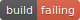
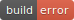

docker-debian-releases
======================

The
[docker-debian-releases](https://github.com/lpenz/docker-debian-releases)
repository creates docker images of Debian-based system using
debootstrap, for various architectures, and uploads them to [docker
hub](https://hub.docker.com/r/lpenz/) using travis.

The tables below detail the result of the latest build attempt, and
links to the image in [docker hub](https://hub.docker.com/r/lpenz/) if
the build was successful. The supported OS's are:

- [Debian](#debian)
- [Devuan](#devuan)
- [Raspbian](#raspbian)
- [Ubuntu](#ubuntu)

Most of the errors are caused by:
- lack of support in qemu for the architecture;
- timeout when building the standard image (that's why minbase is also built);
- incompatibility with modern linux kernel.

### Debian

<table>
<thead>
<tr><th rowspan="2">Release</th><th rowspan="2">Version</th><th rowspan="2">Release date</th><th rowspan="2">Arch</th><th colspan="2">Variant status</th></tr>
<tr><th>standard</th><th>minbase</th></tr>
</thead>
<tbody>
<tr>
    <td>potato</td><td>2.2r7</td><td>2002-07-12T16:16:28Z</td><td>alpha</td>
    <td>
        
    </td>
    <td>
        
    </td>
</tr>
<tr>
    <td>potato</td><td>2.2r7</td><td>2002-07-12T16:16:28Z</td><td>arm</td>
    <td>
        
    </td>
    <td>
        
    </td>
</tr>
<tr>
    <td>potato</td><td>2.2r7</td><td>2002-07-12T16:16:28Z</td><td>i386</td>
    <td>
        
    </td>
    <td>
        
    </td>
</tr>
<tr>
    <td>potato</td><td>2.2r7</td><td>2002-07-12T16:16:28Z</td><td>m68k</td>
    <td>
        
    </td>
    <td>
        
    </td>
</tr>
<tr>
    <td>potato</td><td>2.2r7</td><td>2002-07-12T16:16:28Z</td><td>powerpc</td>
    <td>
        
    </td>
    <td>
        
    </td>
</tr>
<tr>
    <td>potato</td><td>2.2r7</td><td>2002-07-12T16:16:28Z</td><td>sparc</td>
    <td>
        
    </td>
    <td>
        
    </td>
</tr>
<tr>
    <td>woody</td><td>3.0r6</td><td>2005-05-31T20:55:05Z</td><td>alpha</td>
    <td>
        
    </td>
    <td>
        
    </td>
</tr>
<tr>
    <td>woody</td><td>3.0r6</td><td>2005-05-31T20:55:05Z</td><td>arm</td>
    <td>
        
    </td>
    <td>
        
    </td>
</tr>
<tr>
    <td>woody</td><td>3.0r6</td><td>2005-05-31T20:55:05Z</td><td>hppa</td>
    <td>
        
    </td>
    <td>
        
    </td>
</tr>
<tr>
    <td>woody</td><td>3.0r6</td><td>2005-05-31T20:55:05Z</td><td>i386</td>
    <td>
        
    </td>
    <td>
        
    </td>
</tr>
<tr>
    <td>woody</td><td>3.0r6</td><td>2005-05-31T20:55:05Z</td><td>ia64</td>
    <td>
        
    </td>
    <td>
        
    </td>
</tr>
<tr>
    <td>woody</td><td>3.0r6</td><td>2005-05-31T20:55:05Z</td><td>m68k</td>
    <td>
        
    </td>
    <td>
        
    </td>
</tr>
<tr>
    <td>woody</td><td>3.0r6</td><td>2005-05-31T20:55:05Z</td><td>mips</td>
    <td>
        
    </td>
    <td>
        
    </td>
</tr>
<tr>
    <td>woody</td><td>3.0r6</td><td>2005-05-31T20:55:05Z</td><td>mipsel</td>
    <td>
        
    </td>
    <td>
        
    </td>
</tr>
<tr>
    <td>woody</td><td>3.0r6</td><td>2005-05-31T20:55:05Z</td><td>powerpc</td>
    <td>
        
    </td>
    <td>
        
    </td>
</tr>
<tr>
    <td>woody</td><td>3.0r6</td><td>2005-05-31T20:55:05Z</td><td>s390</td>
    <td>
        
    </td>
    <td>
        
    </td>
</tr>
<tr>
    <td>woody</td><td>3.0r6</td><td>2005-05-31T20:55:05Z</td><td>sparc</td>
    <td>
        
    </td>
    <td>
        
    </td>
</tr>
<tr>
    <td>sarge</td><td>3.1r8</td><td>2008-04-12T19:04:58Z</td><td>alpha</td>
    <td>
        
    </td>
    <td>
        
    </td>
</tr>
<tr>
    <td>sarge</td><td>3.1r8</td><td>2008-04-12T19:04:58Z</td><td>arm</td>
    <td>
        
    </td>
    <td>
        
    </td>
</tr>
<tr>
    <td>sarge</td><td>3.1r8</td><td>2008-04-12T19:04:58Z</td><td>hppa</td>
    <td>
        
    </td>
    <td>
        
    </td>
</tr>
<tr>
    <td>sarge</td><td>3.1r8</td><td>2008-04-12T19:04:58Z</td><td>i386</td>
    <td>
        
    </td>
    <td>
        
    </td>
</tr>
<tr>
    <td>sarge</td><td>3.1r8</td><td>2008-04-12T19:04:58Z</td><td>ia64</td>
    <td>
        
    </td>
    <td>
        
    </td>
</tr>
<tr>
    <td>sarge</td><td>3.1r8</td><td>2008-04-12T19:04:58Z</td><td>m68k</td>
    <td>
        
    </td>
    <td>
        
    </td>
</tr>
<tr>
    <td>sarge</td><td>3.1r8</td><td>2008-04-12T19:04:58Z</td><td>mips</td>
    <td>
        
    </td>
    <td>
        
    </td>
</tr>
<tr>
    <td>sarge</td><td>3.1r8</td><td>2008-04-12T19:04:58Z</td><td>mipsel</td>
    <td>
        
    </td>
    <td>
        
    </td>
</tr>
<tr>
    <td>sarge</td><td>3.1r8</td><td>2008-04-12T19:04:58Z</td><td>powerpc</td>
    <td>
        
    </td>
    <td>
        
    </td>
</tr>
<tr>
    <td>sarge</td><td>3.1r8</td><td>2008-04-12T19:04:58Z</td><td>s390</td>
    <td>
        
    </td>
    <td>
        
    </td>
</tr>
<tr>
    <td>sarge</td><td>3.1r8</td><td>2008-04-12T19:04:58Z</td><td>sparc</td>
    <td>
        
    </td>
    <td>
        
    </td>
</tr>
<tr>
    <td>etch</td><td>4.0r9</td><td>2010-05-22T14:22:09Z</td><td>alpha</td>
    <td>
        
    </td>
    <td>
        
    </td>
</tr>
<tr>
    <td>etch</td><td>4.0r9</td><td>2010-05-22T14:22:09Z</td><td>amd64</td>
    <td>
        
    </td>
    <td>
        
    </td>
</tr>
<tr>
    <td>etch</td><td>4.0r9</td><td>2010-05-22T14:22:09Z</td><td>arm</td>
    <td>
        
    </td>
    <td>
        
    </td>
</tr>
<tr>
    <td>etch</td><td>4.0r9</td><td>2010-05-22T14:22:09Z</td><td>hppa</td>
    <td>
        
    </td>
    <td>
        
    </td>
</tr>
<tr>
    <td>etch</td><td>4.0r9</td><td>2010-05-22T14:22:09Z</td><td>i386</td>
    <td>
        
    </td>
    <td>
        
    </td>
</tr>
<tr>
    <td>etch</td><td>4.0r9</td><td>2010-05-22T14:22:09Z</td><td>ia64</td>
    <td>
        
    </td>
    <td>
        
    </td>
</tr>
<tr>
    <td>etch</td><td>4.0r9</td><td>2010-05-22T14:22:09Z</td><td>mips</td>
    <td>
        
    </td>
    <td>
        
    </td>
</tr>
<tr>
    <td>etch</td><td>4.0r9</td><td>2010-05-22T14:22:09Z</td><td>mipsel</td>
    <td>
        
    </td>
    <td>
        
    </td>
</tr>
<tr>
    <td>etch</td><td>4.0r9</td><td>2010-05-22T14:22:09Z</td><td>powerpc</td>
    <td>
        
    </td>
    <td>
        
    </td>
</tr>
<tr>
    <td>etch</td><td>4.0r9</td><td>2010-05-22T14:22:09Z</td><td>s390</td>
    <td>
        
    </td>
    <td>
        
    </td>
</tr>
<tr>
    <td>etch</td><td>4.0r9</td><td>2010-05-22T14:22:09Z</td><td>sparc</td>
    <td>
        
    </td>
    <td>
        
    </td>
</tr>
<tr>
    <td>lenny</td><td>5.0.10</td><td>2012-03-10T11:30:56Z</td><td>alpha</td>
    <td>
        
    </td>
    <td>
        
    </td>
</tr>
<tr>
    <td>lenny</td><td>5.0.10</td><td>2012-03-10T11:30:56Z</td><td>amd64</td>
    <td>
        
    </td>
    <td>
        
    </td>
</tr>
<tr>
    <td>lenny</td><td>5.0.10</td><td>2012-03-10T11:30:56Z</td><td>arm</td>
    <td>
        
    </td>
    <td>
        
    </td>
</tr>
<tr>
    <td>lenny</td><td>5.0.10</td><td>2012-03-10T11:30:56Z</td><td>armel</td>
    <td>
        
    </td>
    <td>
        
    </td>
</tr>
<tr>
    <td>lenny</td><td>5.0.10</td><td>2012-03-10T11:30:56Z</td><td>hppa</td>
    <td>
        
    </td>
    <td>
        
    </td>
</tr>
<tr>
    <td>lenny</td><td>5.0.10</td><td>2012-03-10T11:30:56Z</td><td>i386</td>
    <td>
        
    </td>
    <td>
        
    </td>
</tr>
<tr>
    <td>lenny</td><td>5.0.10</td><td>2012-03-10T11:30:56Z</td><td>ia64</td>
    <td>
        
    </td>
    <td>
        
    </td>
</tr>
<tr>
    <td>lenny</td><td>5.0.10</td><td>2012-03-10T11:30:56Z</td><td>mips</td>
    <td>
        
    </td>
    <td>
        
    </td>
</tr>
<tr>
    <td>lenny</td><td>5.0.10</td><td>2012-03-10T11:30:56Z</td><td>mipsel</td>
    <td>
        
    </td>
    <td>
        
    </td>
</tr>
<tr>
    <td>lenny</td><td>5.0.10</td><td>2012-03-10T11:30:56Z</td><td>powerpc</td>
    <td>
        
    </td>
    <td>
        
    </td>
</tr>
<tr>
    <td>lenny</td><td>5.0.10</td><td>2012-03-10T11:30:56Z</td><td>s390</td>
    <td>
        
    </td>
    <td>
        
    </td>
</tr>
<tr>
    <td>lenny</td><td>5.0.10</td><td>2012-03-10T11:30:56Z</td><td>sparc</td>
    <td>
        
    </td>
    <td>
        
    </td>
</tr>
<tr>
    <td>squeeze</td><td>6.0.10</td><td>2015-04-25T11:01:14Z</td><td>amd64</td>
    <td>
        
    </td>
    <td>
        
    </td>
</tr>
<tr>
    <td>squeeze</td><td>6.0.10</td><td>2015-04-25T11:01:14Z</td><td>armel</td>
    <td>
        
    </td>
    <td>
        
    </td>
</tr>
<tr>
    <td>squeeze</td><td>6.0.10</td><td>2015-04-25T11:01:14Z</td><td>i386</td>
    <td>
        
    </td>
    <td>
        
    </td>
</tr>
<tr>
    <td>squeeze</td><td>6.0.10</td><td>2015-04-25T11:01:14Z</td><td>ia64</td>
    <td>
        
    </td>
    <td>
        
    </td>
</tr>
<tr>
    <td>squeeze</td><td>6.0.10</td><td>2015-04-25T11:01:14Z</td><td>mips</td>
    <td>
        
    </td>
    <td>
        
    </td>
</tr>
<tr>
    <td>squeeze</td><td>6.0.10</td><td>2015-04-25T11:01:14Z</td><td>mipsel</td>
    <td>
        
    </td>
    <td>
        
    </td>
</tr>
<tr>
    <td>squeeze</td><td>6.0.10</td><td>2015-04-25T11:01:14Z</td><td>powerpc</td>
    <td>
        
    </td>
    <td>
        
    </td>
</tr>
<tr>
    <td>squeeze</td><td>6.0.10</td><td>2015-04-25T11:01:14Z</td><td>s390</td>
    <td>
        
    </td>
    <td>
        
    </td>
</tr>
<tr>
    <td>squeeze</td><td>6.0.10</td><td>2015-04-25T11:01:14Z</td><td>sparc</td>
    <td>
        
    </td>
    <td>
        
    </td>
</tr>
<tr>
    <td>wheezy</td><td>7.11</td><td>2017-06-17T08:55:32Z</td><td>amd64</td>
    <td>
        
    </td>
    <td>
        
    </td>
</tr>
<tr>
    <td>wheezy</td><td>7.11</td><td>2017-06-17T08:55:32Z</td><td>armel</td>
    <td>
        
    </td>
    <td>
        
    </td>
</tr>
<tr>
    <td>wheezy</td><td>7.11</td><td>2017-06-17T08:55:32Z</td><td>armhf</td>
    <td>
        
    </td>
    <td>
        
    </td>
</tr>
<tr>
    <td>wheezy</td><td>7.11</td><td>2017-06-17T08:55:32Z</td><td>i386</td>
    <td>
        
    </td>
    <td>
        
    </td>
</tr>
<tr>
    <td>wheezy</td><td>7.11</td><td>2017-06-17T08:55:32Z</td><td>ia64</td>
    <td>
        
    </td>
    <td>
        
    </td>
</tr>
<tr>
    <td>wheezy</td><td>7.11</td><td>2017-06-17T08:55:32Z</td><td>mips</td>
    <td>
        
    </td>
    <td>
        
    </td>
</tr>
<tr>
    <td>wheezy</td><td>7.11</td><td>2017-06-17T08:55:32Z</td><td>mipsel</td>
    <td>
        
    </td>
    <td>
        
    </td>
</tr>
<tr>
    <td>wheezy</td><td>7.11</td><td>2017-06-17T08:55:32Z</td><td>powerpc</td>
    <td>
        
    </td>
    <td>
        
    </td>
</tr>
<tr>
    <td>wheezy</td><td>7.11</td><td>2017-06-17T08:55:32Z</td><td>s390</td>
    <td>
        
    </td>
    <td>
        
    </td>
</tr>
<tr>
    <td>wheezy</td><td>7.11</td><td>2017-06-17T08:55:32Z</td><td>s390x</td>
    <td>
        
    </td>
    <td>
        
    </td>
</tr>
<tr>
    <td>wheezy</td><td>7.11</td><td>2017-06-17T08:55:32Z</td><td>sparc</td>
    <td>
        
    </td>
    <td>
        
    </td>
</tr>
<tr>
    <td>jessie</td><td>8.11</td><td>2018-06-23T10:30:18Z</td><td>amd64</td>
    <td>
        
    </td>
    <td>
        
    </td>
</tr>
<tr>
    <td>jessie</td><td>8.11</td><td>2018-06-23T10:30:18Z</td><td>arm64</td>
    <td>
        
    </td>
    <td>
        
    </td>
</tr>
<tr>
    <td>jessie</td><td>8.11</td><td>2018-06-23T10:30:18Z</td><td>armel</td>
    <td>
        
    </td>
    <td>
        
    </td>
</tr>
<tr>
    <td>jessie</td><td>8.11</td><td>2018-06-23T10:30:18Z</td><td>armhf</td>
    <td>
        
    </td>
    <td>
        
    </td>
</tr>
<tr>
    <td>jessie</td><td>8.11</td><td>2018-06-23T10:30:18Z</td><td>i386</td>
    <td>
        
    </td>
    <td>
        
    </td>
</tr>
<tr>
    <td>jessie</td><td>8.11</td><td>2018-06-23T10:30:18Z</td><td>mips</td>
    <td>
        
    </td>
    <td>
        
    </td>
</tr>
<tr>
    <td>jessie</td><td>8.11</td><td>2018-06-23T10:30:18Z</td><td>mipsel</td>
    <td>
        
    </td>
    <td>
        
    </td>
</tr>
<tr>
    <td>jessie</td><td>8.11</td><td>2018-06-23T10:30:18Z</td><td>powerpc</td>
    <td>
        
    </td>
    <td>
        
    </td>
</tr>
<tr>
    <td>jessie</td><td>8.11</td><td>2018-06-23T10:30:18Z</td><td>ppc64el</td>
    <td>
        
    </td>
    <td>
        
    </td>
</tr>
<tr>
    <td>jessie</td><td>8.11</td><td>2018-06-23T10:30:18Z</td><td>s390x</td>
    <td>
        
    </td>
    <td>
        
    </td>
</tr>
<tr>
    <td>jessie</td><td>8.11</td><td>2019-07-06T09:36:16Z</td><td>amd64</td>
    <td>
        
    </td>
    <td>
        
    </td>
</tr>
<tr>
    <td>jessie</td><td>8.11</td><td>2019-07-06T09:36:16Z</td><td>armel</td>
    <td>
        
    </td>
    <td>
        
    </td>
</tr>
<tr>
    <td>jessie</td><td>8.11</td><td>2019-07-06T09:36:16Z</td><td>armhf</td>
    <td>
        
    </td>
    <td>
        
    </td>
</tr>
<tr>
    <td>jessie</td><td>8.11</td><td>2019-07-06T09:36:16Z</td><td>i386</td>
    <td>
        
    </td>
    <td>
        
    </td>
</tr>
<tr>
    <td>stretch</td><td>9.13</td><td>2020-07-18T10:50:51Z</td><td>amd64</td>
    <td>
        
    </td>
    <td>
        
    </td>
</tr>
<tr>
    <td>stretch</td><td>9.13</td><td>2020-07-18T10:50:51Z</td><td>arm64</td>
    <td>
        
    </td>
    <td>
        
    </td>
</tr>
<tr>
    <td>stretch</td><td>9.13</td><td>2020-07-18T10:50:51Z</td><td>armel</td>
    <td>
        
    </td>
    <td>
        
    </td>
</tr>
<tr>
    <td>stretch</td><td>9.13</td><td>2020-07-18T10:50:51Z</td><td>armhf</td>
    <td>
        
    </td>
    <td>
        
    </td>
</tr>
<tr>
    <td>stretch</td><td>9.13</td><td>2020-07-18T10:50:51Z</td><td>i386</td>
    <td>
        
    </td>
    <td>
        
    </td>
</tr>
<tr>
    <td>stretch</td><td>9.13</td><td>2020-07-18T10:50:51Z</td><td>mips</td>
    <td>
        
    </td>
    <td>
        
    </td>
</tr>
<tr>
    <td>stretch</td><td>9.13</td><td>2020-07-18T10:50:51Z</td><td>mips64el</td>
    <td>
        
    </td>
    <td>
        
    </td>
</tr>
<tr>
    <td>stretch</td><td>9.13</td><td>2020-07-18T10:50:51Z</td><td>mipsel</td>
    <td>
        
    </td>
    <td>
        
    </td>
</tr>
<tr>
    <td>stretch</td><td>9.13</td><td>2020-07-18T10:50:51Z</td><td>ppc64el</td>
    <td>
        
    </td>
    <td>
        
    </td>
</tr>
<tr>
    <td>stretch</td><td>9.13</td><td>2020-07-18T10:50:51Z</td><td>s390x</td>
    <td>
        
    </td>
    <td>
        
    </td>
</tr>
<tr>
    <td>buster</td><td>10.8</td><td>2021-02-06T10:10:28Z</td><td>amd64</td>
    <td>
        
    </td>
    <td>
        
    </td>
</tr>
<tr>
    <td>buster</td><td>10.8</td><td>2021-02-06T10:10:28Z</td><td>arm64</td>
    <td>
        
    </td>
    <td>
        
    </td>
</tr>
<tr>
    <td>buster</td><td>10.8</td><td>2021-02-06T10:10:28Z</td><td>armel</td>
    <td>
        
    </td>
    <td>
        
    </td>
</tr>
<tr>
    <td>buster</td><td>10.8</td><td>2021-02-06T10:10:28Z</td><td>armhf</td>
    <td>
        
    </td>
    <td>
        
    </td>
</tr>
<tr>
    <td>buster</td><td>10.8</td><td>2021-02-06T10:10:28Z</td><td>i386</td>
    <td>
        
    </td>
    <td>
        
    </td>
</tr>
<tr>
    <td>buster</td><td>10.8</td><td>2021-02-06T10:10:28Z</td><td>mips</td>
    <td>
        
    </td>
    <td>
        
    </td>
</tr>
<tr>
    <td>buster</td><td>10.8</td><td>2021-02-06T10:10:28Z</td><td>mips64el</td>
    <td>
        
    </td>
    <td>
        
    </td>
</tr>
<tr>
    <td>buster</td><td>10.8</td><td>2021-02-06T10:10:28Z</td><td>mipsel</td>
    <td>
        
    </td>
    <td>
        
    </td>
</tr>
<tr>
    <td>buster</td><td>10.8</td><td>2021-02-06T10:10:28Z</td><td>ppc64el</td>
    <td>
        
    </td>
    <td>
        
    </td>
</tr>
<tr>
    <td>buster</td><td>10.8</td><td>2021-02-06T10:10:28Z</td><td>s390x</td>
    <td>
        
    </td>
    <td>
        
    </td>
</tr>
<tr>
    <td>bullseye</td><td></td><td>2021-02-10T20:10:54Z</td><td>all</td>
    <td>
        
    </td>
    <td>
        
    </td>
</tr>
<tr>
    <td>bullseye</td><td></td><td>2021-02-10T20:10:54Z</td><td>amd64</td>
    <td>
        
    </td>
    <td>
        
    </td>
</tr>
<tr>
    <td>bullseye</td><td></td><td>2021-02-10T20:10:54Z</td><td>arm64</td>
    <td>
        
    </td>
    <td>
        
    </td>
</tr>
<tr>
    <td>bullseye</td><td></td><td>2021-02-10T20:10:54Z</td><td>armel</td>
    <td>
        
    </td>
    <td>
        
    </td>
</tr>
<tr>
    <td>bullseye</td><td></td><td>2021-02-10T20:10:54Z</td><td>armhf</td>
    <td>
        
    </td>
    <td>
        
    </td>
</tr>
<tr>
    <td>bullseye</td><td></td><td>2021-02-10T20:10:54Z</td><td>i386</td>
    <td>
        
    </td>
    <td>
        
    </td>
</tr>
<tr>
    <td>bullseye</td><td></td><td>2021-02-10T20:10:54Z</td><td>mips64el</td>
    <td>
        
    </td>
    <td>
        
    </td>
</tr>
<tr>
    <td>bullseye</td><td></td><td>2021-02-10T20:10:54Z</td><td>mipsel</td>
    <td>
        
    </td>
    <td>
        
    </td>
</tr>
<tr>
    <td>bullseye</td><td></td><td>2021-02-10T20:10:54Z</td><td>ppc64el</td>
    <td>
        
    </td>
    <td>
        
    </td>
</tr>
<tr>
    <td>bullseye</td><td></td><td>2021-02-10T20:10:54Z</td><td>s390x</td>
    <td>
        
    </td>
    <td>
        
    </td>
</tr>
<tr>
    <td>experimental</td><td></td><td>2021-02-10T20:10:54Z</td><td>all</td>
    <td>
        
    </td>
    <td>
        
    </td>
</tr>
<tr>
    <td>experimental</td><td></td><td>2021-02-10T20:10:54Z</td><td>amd64</td>
    <td>
        
    </td>
    <td>
        
    </td>
</tr>
<tr>
    <td>experimental</td><td></td><td>2021-02-10T20:10:54Z</td><td>arm64</td>
    <td>
        
    </td>
    <td>
        
    </td>
</tr>
<tr>
    <td>experimental</td><td></td><td>2021-02-10T20:10:54Z</td><td>armel</td>
    <td>
        
    </td>
    <td>
        
    </td>
</tr>
<tr>
    <td>experimental</td><td></td><td>2021-02-10T20:10:54Z</td><td>armhf</td>
    <td>
        
    </td>
    <td>
        
    </td>
</tr>
<tr>
    <td>experimental</td><td></td><td>2021-02-10T20:10:54Z</td><td>i386</td>
    <td>
        
    </td>
    <td>
        
    </td>
</tr>
<tr>
    <td>experimental</td><td></td><td>2021-02-10T20:10:54Z</td><td>mips64el</td>
    <td>
        
    </td>
    <td>
        
    </td>
</tr>
<tr>
    <td>experimental</td><td></td><td>2021-02-10T20:10:54Z</td><td>mipsel</td>
    <td>
        
    </td>
    <td>
        
    </td>
</tr>
<tr>
    <td>experimental</td><td></td><td>2021-02-10T20:10:54Z</td><td>ppc64el</td>
    <td>
        
    </td>
    <td>
        
    </td>
</tr>
<tr>
    <td>experimental</td><td></td><td>2021-02-10T20:10:54Z</td><td>s390x</td>
    <td>
        
    </td>
    <td>
        
    </td>
</tr>
<tr>
    <td>sid</td><td></td><td>2021-02-10T20:10:54Z</td><td>all</td>
    <td>
        
    </td>
    <td>
        
    </td>
</tr>
<tr>
    <td>sid</td><td></td><td>2021-02-10T20:10:54Z</td><td>amd64</td>
    <td>
        
    </td>
    <td>
        
    </td>
</tr>
<tr>
    <td>sid</td><td></td><td>2021-02-10T20:10:54Z</td><td>arm64</td>
    <td>
        
    </td>
    <td>
        
    </td>
</tr>
<tr>
    <td>sid</td><td></td><td>2021-02-10T20:10:54Z</td><td>armel</td>
    <td>
        
    </td>
    <td>
        
    </td>
</tr>
<tr>
    <td>sid</td><td></td><td>2021-02-10T20:10:54Z</td><td>armhf</td>
    <td>
        
    </td>
    <td>
        
    </td>
</tr>
<tr>
    <td>sid</td><td></td><td>2021-02-10T20:10:54Z</td><td>i386</td>
    <td>
        
    </td>
    <td>
        
    </td>
</tr>
<tr>
    <td>sid</td><td></td><td>2021-02-10T20:10:54Z</td><td>mips64el</td>
    <td>
        
    </td>
    <td>
        
    </td>
</tr>
<tr>
    <td>sid</td><td></td><td>2021-02-10T20:10:54Z</td><td>mipsel</td>
    <td>
        
    </td>
    <td>
        
    </td>
</tr>
<tr>
    <td>sid</td><td></td><td>2021-02-10T20:10:54Z</td><td>ppc64el</td>
    <td>
        
    </td>
    <td>
        
    </td>
</tr>
<tr>
    <td>sid</td><td></td><td>2021-02-10T20:10:54Z</td><td>s390x</td>
    <td>
        
    </td>
    <td>
        
    </td>
</tr>
</tbody>
</table>

### Devuan

<table>
<thead>
<tr><th rowspan="2">Release</th><th rowspan="2">Version</th><th rowspan="2">Release date</th><th rowspan="2">Arch</th><th colspan="2">Variant status</th></tr>
<tr><th>standard</th><th>minbase</th></tr>
</thead>
<tbody>
<tr>
    <td>jessie</td><td>1.0</td><td>2021-02-10T03:30:01Z</td><td>amd64</td>
    <td>
        
    </td>
    <td>
        
    </td>
</tr>
<tr>
    <td>jessie</td><td>1.0</td><td>2021-02-10T03:30:01Z</td><td>arm64</td>
    <td>
        
    </td>
    <td>
        
    </td>
</tr>
<tr>
    <td>jessie</td><td>1.0</td><td>2021-02-10T03:30:01Z</td><td>armel</td>
    <td>
        
    </td>
    <td>
        
    </td>
</tr>
<tr>
    <td>jessie</td><td>1.0</td><td>2021-02-10T03:30:01Z</td><td>armhf</td>
    <td>
        
    </td>
    <td>
        
    </td>
</tr>
<tr>
    <td>jessie</td><td>1.0</td><td>2021-02-10T03:30:01Z</td><td>i386</td>
    <td>
        
    </td>
    <td>
        
    </td>
</tr>
<tr>
    <td>jessie</td><td>1.0</td><td>2021-02-10T03:30:01Z</td><td>ppc64el</td>
    <td>
        
    </td>
    <td>
        
    </td>
</tr>
<tr>
    <td>ascii</td><td>2.1</td><td>2021-02-10T03:30:02Z</td><td>amd64</td>
    <td>
        
    </td>
    <td>
        
    </td>
</tr>
<tr>
    <td>ascii</td><td>2.1</td><td>2021-02-10T03:30:02Z</td><td>arm64</td>
    <td>
        
    </td>
    <td>
        
    </td>
</tr>
<tr>
    <td>ascii</td><td>2.1</td><td>2021-02-10T03:30:02Z</td><td>armel</td>
    <td>
        
    </td>
    <td>
        
    </td>
</tr>
<tr>
    <td>ascii</td><td>2.1</td><td>2021-02-10T03:30:02Z</td><td>armhf</td>
    <td>
        
    </td>
    <td>
        
    </td>
</tr>
<tr>
    <td>ascii</td><td>2.1</td><td>2021-02-10T03:30:02Z</td><td>i386</td>
    <td>
        
    </td>
    <td>
        
    </td>
</tr>
<tr>
    <td>ascii</td><td>2.1</td><td>2021-02-10T03:30:02Z</td><td>ppc64el</td>
    <td>
        
    </td>
    <td>
        
    </td>
</tr>
<tr>
    <td>beowulf</td><td>3.0</td><td>2021-02-10T03:30:03Z</td><td>amd64</td>
    <td>
        
    </td>
    <td>
        
    </td>
</tr>
<tr>
    <td>beowulf</td><td>3.0</td><td>2021-02-10T03:30:03Z</td><td>arm64</td>
    <td>
        
    </td>
    <td>
        
    </td>
</tr>
<tr>
    <td>beowulf</td><td>3.0</td><td>2021-02-10T03:30:03Z</td><td>armel</td>
    <td>
        
    </td>
    <td>
        
    </td>
</tr>
<tr>
    <td>beowulf</td><td>3.0</td><td>2021-02-10T03:30:03Z</td><td>armhf</td>
    <td>
        
    </td>
    <td>
        
    </td>
</tr>
<tr>
    <td>beowulf</td><td>3.0</td><td>2021-02-10T03:30:03Z</td><td>i386</td>
    <td>
        
    </td>
    <td>
        
    </td>
</tr>
<tr>
    <td>beowulf</td><td>3.0</td><td>2021-02-10T03:30:03Z</td><td>ppc64el</td>
    <td>
        
    </td>
    <td>
        
    </td>
</tr>
<tr>
    <td>chimaera</td><td>4.0.0</td><td>2021-02-10T20:35:45Z</td><td>amd64</td>
    <td>
        
    </td>
    <td>
        
    </td>
</tr>
<tr>
    <td>chimaera</td><td>4.0.0</td><td>2021-02-10T20:35:45Z</td><td>arm64</td>
    <td>
        
    </td>
    <td>
        
    </td>
</tr>
<tr>
    <td>chimaera</td><td>4.0.0</td><td>2021-02-10T20:35:45Z</td><td>armel</td>
    <td>
        
    </td>
    <td>
        
    </td>
</tr>
<tr>
    <td>chimaera</td><td>4.0.0</td><td>2021-02-10T20:35:45Z</td><td>armhf</td>
    <td>
        
    </td>
    <td>
        
    </td>
</tr>
<tr>
    <td>chimaera</td><td>4.0.0</td><td>2021-02-10T20:35:45Z</td><td>i386</td>
    <td>
        
    </td>
    <td>
        
    </td>
</tr>
<tr>
    <td>chimaera</td><td>4.0.0</td><td>2021-02-10T20:35:45Z</td><td>ppc64el</td>
    <td>
        
    </td>
    <td>
        
    </td>
</tr>
<tr>
    <td>ceres</td><td>1.0.0</td><td>2021-02-10T20:37:49Z</td><td>amd64</td>
    <td>
        
    </td>
    <td>
        
    </td>
</tr>
<tr>
    <td>ceres</td><td>1.0.0</td><td>2021-02-10T20:37:49Z</td><td>arm64</td>
    <td>
        
    </td>
    <td>
        
    </td>
</tr>
<tr>
    <td>ceres</td><td>1.0.0</td><td>2021-02-10T20:37:49Z</td><td>armel</td>
    <td>
        
    </td>
    <td>
        
    </td>
</tr>
<tr>
    <td>ceres</td><td>1.0.0</td><td>2021-02-10T20:37:49Z</td><td>armhf</td>
    <td>
        
    </td>
    <td>
        
    </td>
</tr>
<tr>
    <td>ceres</td><td>1.0.0</td><td>2021-02-10T20:37:49Z</td><td>i386</td>
    <td>
        
    </td>
    <td>
        
    </td>
</tr>
<tr>
    <td>ceres</td><td>1.0.0</td><td>2021-02-10T20:37:49Z</td><td>ppc64el</td>
    <td>
        
    </td>
    <td>
        
    </td>
</tr>
<tr>
    <td>ascii</td><td>2.0.0</td><td>2021-02-10T03:27:13Z</td><td>alpha</td>
    <td>
        
    </td>
    <td>
        
    </td>
</tr>
<tr>
    <td>ascii</td><td>2.0.0</td><td>2021-02-10T03:27:13Z</td><td>amd64</td>
    <td>
        
    </td>
    <td>
        
    </td>
</tr>
<tr>
    <td>ascii</td><td>2.0.0</td><td>2021-02-10T03:27:13Z</td><td>arm64</td>
    <td>
        
    </td>
    <td>
        
    </td>
</tr>
<tr>
    <td>ascii</td><td>2.0.0</td><td>2021-02-10T03:27:13Z</td><td>armel</td>
    <td>
        
    </td>
    <td>
        
    </td>
</tr>
<tr>
    <td>ascii</td><td>2.0.0</td><td>2021-02-10T03:27:13Z</td><td>armhf</td>
    <td>
        
    </td>
    <td>
        
    </td>
</tr>
<tr>
    <td>ascii</td><td>2.0.0</td><td>2021-02-10T03:27:13Z</td><td>hppa</td>
    <td>
        
    </td>
    <td>
        
    </td>
</tr>
<tr>
    <td>ascii</td><td>2.0.0</td><td>2021-02-10T03:27:13Z</td><td>i386</td>
    <td>
        
    </td>
    <td>
        
    </td>
</tr>
<tr>
    <td>ascii</td><td>2.0.0</td><td>2021-02-10T03:27:13Z</td><td>ia64</td>
    <td>
        
    </td>
    <td>
        
    </td>
</tr>
<tr>
    <td>ascii</td><td>2.0.0</td><td>2021-02-10T03:27:13Z</td><td>m32</td>
    <td>
        
    </td>
    <td>
        
    </td>
</tr>
<tr>
    <td>ascii</td><td>2.0.0</td><td>2021-02-10T03:27:13Z</td><td>m68k</td>
    <td>
        
    </td>
    <td>
        
    </td>
</tr>
<tr>
    <td>ascii</td><td>2.0.0</td><td>2021-02-10T03:27:13Z</td><td>mips</td>
    <td>
        
    </td>
    <td>
        
    </td>
</tr>
<tr>
    <td>ascii</td><td>2.0.0</td><td>2021-02-10T03:27:13Z</td><td>mipsel</td>
    <td>
        
    </td>
    <td>
        
    </td>
</tr>
<tr>
    <td>ascii</td><td>2.0.0</td><td>2021-02-10T03:27:13Z</td><td>or1k</td>
    <td>
        
    </td>
    <td>
        
    </td>
</tr>
<tr>
    <td>ascii</td><td>2.0.0</td><td>2021-02-10T03:27:13Z</td><td>powerpc</td>
    <td>
        
    </td>
    <td>
        
    </td>
</tr>
<tr>
    <td>ascii</td><td>2.0.0</td><td>2021-02-10T03:27:13Z</td><td>ppc64el</td>
    <td>
        
    </td>
    <td>
        
    </td>
</tr>
<tr>
    <td>ascii</td><td>2.0.0</td><td>2021-02-10T03:27:13Z</td><td>s390</td>
    <td>
        
    </td>
    <td>
        
    </td>
</tr>
<tr>
    <td>ascii</td><td>2.0.0</td><td>2021-02-10T03:27:13Z</td><td>s390x</td>
    <td>
        
    </td>
    <td>
        
    </td>
</tr>
<tr>
    <td>ascii</td><td>2.0.0</td><td>2021-02-10T03:27:13Z</td><td>sparc</td>
    <td>
        
    </td>
    <td>
        
    </td>
</tr>
<tr>
    <td>beowulf</td><td>3.0</td><td>2021-02-10T03:27:13Z</td><td>alpha</td>
    <td>
        
    </td>
    <td>
        
    </td>
</tr>
<tr>
    <td>beowulf</td><td>3.0</td><td>2021-02-10T03:27:13Z</td><td>amd64</td>
    <td>
        
    </td>
    <td>
        
    </td>
</tr>
<tr>
    <td>beowulf</td><td>3.0</td><td>2021-02-10T03:27:13Z</td><td>arm64</td>
    <td>
        
    </td>
    <td>
        
    </td>
</tr>
<tr>
    <td>beowulf</td><td>3.0</td><td>2021-02-10T03:27:13Z</td><td>armel</td>
    <td>
        
    </td>
    <td>
        
    </td>
</tr>
<tr>
    <td>beowulf</td><td>3.0</td><td>2021-02-10T03:27:13Z</td><td>armhf</td>
    <td>
        
    </td>
    <td>
        
    </td>
</tr>
<tr>
    <td>beowulf</td><td>3.0</td><td>2021-02-10T03:27:13Z</td><td>hppa</td>
    <td>
        
    </td>
    <td>
        
    </td>
</tr>
<tr>
    <td>beowulf</td><td>3.0</td><td>2021-02-10T03:27:13Z</td><td>i386</td>
    <td>
        
    </td>
    <td>
        
    </td>
</tr>
<tr>
    <td>beowulf</td><td>3.0</td><td>2021-02-10T03:27:13Z</td><td>ia64</td>
    <td>
        
    </td>
    <td>
        
    </td>
</tr>
<tr>
    <td>beowulf</td><td>3.0</td><td>2021-02-10T03:27:13Z</td><td>m32</td>
    <td>
        
    </td>
    <td>
        
    </td>
</tr>
<tr>
    <td>beowulf</td><td>3.0</td><td>2021-02-10T03:27:13Z</td><td>m68k</td>
    <td>
        
    </td>
    <td>
        
    </td>
</tr>
<tr>
    <td>beowulf</td><td>3.0</td><td>2021-02-10T03:27:13Z</td><td>mips</td>
    <td>
        
    </td>
    <td>
        
    </td>
</tr>
<tr>
    <td>beowulf</td><td>3.0</td><td>2021-02-10T03:27:13Z</td><td>mipsel</td>
    <td>
        
    </td>
    <td>
        
    </td>
</tr>
<tr>
    <td>beowulf</td><td>3.0</td><td>2021-02-10T03:27:13Z</td><td>or1k</td>
    <td>
        
    </td>
    <td>
        
    </td>
</tr>
<tr>
    <td>beowulf</td><td>3.0</td><td>2021-02-10T03:27:13Z</td><td>powerpc</td>
    <td>
        
    </td>
    <td>
        
    </td>
</tr>
<tr>
    <td>beowulf</td><td>3.0</td><td>2021-02-10T03:27:13Z</td><td>ppc64el</td>
    <td>
        
    </td>
    <td>
        
    </td>
</tr>
<tr>
    <td>beowulf</td><td>3.0</td><td>2021-02-10T03:27:13Z</td><td>s390</td>
    <td>
        
    </td>
    <td>
        
    </td>
</tr>
<tr>
    <td>beowulf</td><td>3.0</td><td>2021-02-10T03:27:13Z</td><td>s390x</td>
    <td>
        
    </td>
    <td>
        
    </td>
</tr>
<tr>
    <td>beowulf</td><td>3.0</td><td>2021-02-10T03:27:13Z</td><td>sparc</td>
    <td>
        
    </td>
    <td>
        
    </td>
</tr>
<tr>
    <td>chimaera</td><td>4.0.0</td><td>2021-02-10T19:08:45Z</td><td>alpha</td>
    <td>
        
    </td>
    <td>
        
    </td>
</tr>
<tr>
    <td>chimaera</td><td>4.0.0</td><td>2021-02-10T19:08:45Z</td><td>amd64</td>
    <td>
        
    </td>
    <td>
        
    </td>
</tr>
<tr>
    <td>chimaera</td><td>4.0.0</td><td>2021-02-10T19:08:45Z</td><td>arm64</td>
    <td>
        
    </td>
    <td>
        
    </td>
</tr>
<tr>
    <td>chimaera</td><td>4.0.0</td><td>2021-02-10T19:08:45Z</td><td>armel</td>
    <td>
        
    </td>
    <td>
        
    </td>
</tr>
<tr>
    <td>chimaera</td><td>4.0.0</td><td>2021-02-10T19:08:45Z</td><td>armhf</td>
    <td>
        
    </td>
    <td>
        
    </td>
</tr>
<tr>
    <td>chimaera</td><td>4.0.0</td><td>2021-02-10T19:08:45Z</td><td>hppa</td>
    <td>
        
    </td>
    <td>
        
    </td>
</tr>
<tr>
    <td>chimaera</td><td>4.0.0</td><td>2021-02-10T19:08:45Z</td><td>i386</td>
    <td>
        
    </td>
    <td>
        
    </td>
</tr>
<tr>
    <td>chimaera</td><td>4.0.0</td><td>2021-02-10T19:08:45Z</td><td>ia64</td>
    <td>
        
    </td>
    <td>
        
    </td>
</tr>
<tr>
    <td>chimaera</td><td>4.0.0</td><td>2021-02-10T19:08:45Z</td><td>m32</td>
    <td>
        
    </td>
    <td>
        
    </td>
</tr>
<tr>
    <td>chimaera</td><td>4.0.0</td><td>2021-02-10T19:08:45Z</td><td>m68k</td>
    <td>
        
    </td>
    <td>
        
    </td>
</tr>
<tr>
    <td>chimaera</td><td>4.0.0</td><td>2021-02-10T19:08:45Z</td><td>mips</td>
    <td>
        
    </td>
    <td>
        
    </td>
</tr>
<tr>
    <td>chimaera</td><td>4.0.0</td><td>2021-02-10T19:08:45Z</td><td>mipsel</td>
    <td>
        
    </td>
    <td>
        
    </td>
</tr>
<tr>
    <td>chimaera</td><td>4.0.0</td><td>2021-02-10T19:08:45Z</td><td>or1k</td>
    <td>
        
    </td>
    <td>
        
    </td>
</tr>
<tr>
    <td>chimaera</td><td>4.0.0</td><td>2021-02-10T19:08:45Z</td><td>powerpc</td>
    <td>
        
    </td>
    <td>
        
    </td>
</tr>
<tr>
    <td>chimaera</td><td>4.0.0</td><td>2021-02-10T19:08:45Z</td><td>ppc64el</td>
    <td>
        
    </td>
    <td>
        
    </td>
</tr>
<tr>
    <td>chimaera</td><td>4.0.0</td><td>2021-02-10T19:08:45Z</td><td>s390</td>
    <td>
        
    </td>
    <td>
        
    </td>
</tr>
<tr>
    <td>chimaera</td><td>4.0.0</td><td>2021-02-10T19:08:45Z</td><td>s390x</td>
    <td>
        
    </td>
    <td>
        
    </td>
</tr>
<tr>
    <td>chimaera</td><td>4.0.0</td><td>2021-02-10T19:08:45Z</td><td>sparc</td>
    <td>
        
    </td>
    <td>
        
    </td>
</tr>
<tr>
    <td>ceres</td><td>1.0.0</td><td>2021-02-10T03:27:11Z</td><td>alpha</td>
    <td>
        
    </td>
    <td>
        
    </td>
</tr>
<tr>
    <td>ceres</td><td>1.0.0</td><td>2021-02-10T03:27:11Z</td><td>amd64</td>
    <td>
        
    </td>
    <td>
        
    </td>
</tr>
<tr>
    <td>ceres</td><td>1.0.0</td><td>2021-02-10T03:27:11Z</td><td>arm64</td>
    <td>
        
    </td>
    <td>
        
    </td>
</tr>
<tr>
    <td>ceres</td><td>1.0.0</td><td>2021-02-10T03:27:11Z</td><td>armel</td>
    <td>
        
    </td>
    <td>
        
    </td>
</tr>
<tr>
    <td>ceres</td><td>1.0.0</td><td>2021-02-10T03:27:11Z</td><td>armhf</td>
    <td>
        
    </td>
    <td>
        
    </td>
</tr>
<tr>
    <td>ceres</td><td>1.0.0</td><td>2021-02-10T03:27:11Z</td><td>hppa</td>
    <td>
        
    </td>
    <td>
        
    </td>
</tr>
<tr>
    <td>ceres</td><td>1.0.0</td><td>2021-02-10T03:27:11Z</td><td>i386</td>
    <td>
        
    </td>
    <td>
        
    </td>
</tr>
<tr>
    <td>ceres</td><td>1.0.0</td><td>2021-02-10T03:27:11Z</td><td>ia64</td>
    <td>
        
    </td>
    <td>
        
    </td>
</tr>
<tr>
    <td>ceres</td><td>1.0.0</td><td>2021-02-10T03:27:11Z</td><td>m32</td>
    <td>
        
    </td>
    <td>
        
    </td>
</tr>
<tr>
    <td>ceres</td><td>1.0.0</td><td>2021-02-10T03:27:11Z</td><td>m68k</td>
    <td>
        
    </td>
    <td>
        
    </td>
</tr>
<tr>
    <td>ceres</td><td>1.0.0</td><td>2021-02-10T03:27:11Z</td><td>mips</td>
    <td>
        
    </td>
    <td>
        
    </td>
</tr>
<tr>
    <td>ceres</td><td>1.0.0</td><td>2021-02-10T03:27:11Z</td><td>mipsel</td>
    <td>
        
    </td>
    <td>
        
    </td>
</tr>
<tr>
    <td>ceres</td><td>1.0.0</td><td>2021-02-10T03:27:11Z</td><td>or1k</td>
    <td>
        
    </td>
    <td>
        
    </td>
</tr>
<tr>
    <td>ceres</td><td>1.0.0</td><td>2021-02-10T03:27:11Z</td><td>powerpc</td>
    <td>
        
    </td>
    <td>
        
    </td>
</tr>
<tr>
    <td>ceres</td><td>1.0.0</td><td>2021-02-10T03:27:11Z</td><td>ppc64el</td>
    <td>
        
    </td>
    <td>
        
    </td>
</tr>
<tr>
    <td>ceres</td><td>1.0.0</td><td>2021-02-10T03:27:11Z</td><td>s390</td>
    <td>
        
    </td>
    <td>
        
    </td>
</tr>
<tr>
    <td>ceres</td><td>1.0.0</td><td>2021-02-10T03:27:11Z</td><td>s390x</td>
    <td>
        
    </td>
    <td>
        
    </td>
</tr>
<tr>
    <td>ceres</td><td>1.0.0</td><td>2021-02-10T03:27:11Z</td><td>sparc</td>
    <td>
        
    </td>
    <td>
        
    </td>
</tr>
<tr>
    <td>experimental</td><td>1.0.0</td><td>2021-02-10T03:27:05Z</td><td>alpha</td>
    <td>
        
    </td>
    <td>
        
    </td>
</tr>
<tr>
    <td>experimental</td><td>1.0.0</td><td>2021-02-10T03:27:05Z</td><td>amd64</td>
    <td>
        
    </td>
    <td>
        
    </td>
</tr>
<tr>
    <td>experimental</td><td>1.0.0</td><td>2021-02-10T03:27:05Z</td><td>arm64</td>
    <td>
        
    </td>
    <td>
        
    </td>
</tr>
<tr>
    <td>experimental</td><td>1.0.0</td><td>2021-02-10T03:27:05Z</td><td>armel</td>
    <td>
        
    </td>
    <td>
        
    </td>
</tr>
<tr>
    <td>experimental</td><td>1.0.0</td><td>2021-02-10T03:27:05Z</td><td>armhf</td>
    <td>
        
    </td>
    <td>
        
    </td>
</tr>
<tr>
    <td>experimental</td><td>1.0.0</td><td>2021-02-10T03:27:05Z</td><td>hppa</td>
    <td>
        
    </td>
    <td>
        
    </td>
</tr>
<tr>
    <td>experimental</td><td>1.0.0</td><td>2021-02-10T03:27:05Z</td><td>i386</td>
    <td>
        
    </td>
    <td>
        
    </td>
</tr>
<tr>
    <td>experimental</td><td>1.0.0</td><td>2021-02-10T03:27:05Z</td><td>ia64</td>
    <td>
        
    </td>
    <td>
        
    </td>
</tr>
<tr>
    <td>experimental</td><td>1.0.0</td><td>2021-02-10T03:27:05Z</td><td>m32</td>
    <td>
        
    </td>
    <td>
        
    </td>
</tr>
<tr>
    <td>experimental</td><td>1.0.0</td><td>2021-02-10T03:27:05Z</td><td>m68k</td>
    <td>
        
    </td>
    <td>
        
    </td>
</tr>
<tr>
    <td>experimental</td><td>1.0.0</td><td>2021-02-10T03:27:05Z</td><td>mips</td>
    <td>
        
    </td>
    <td>
        
    </td>
</tr>
<tr>
    <td>experimental</td><td>1.0.0</td><td>2021-02-10T03:27:05Z</td><td>mipsel</td>
    <td>
        
    </td>
    <td>
        
    </td>
</tr>
<tr>
    <td>experimental</td><td>1.0.0</td><td>2021-02-10T03:27:05Z</td><td>or1k</td>
    <td>
        
    </td>
    <td>
        
    </td>
</tr>
<tr>
    <td>experimental</td><td>1.0.0</td><td>2021-02-10T03:27:05Z</td><td>powerpc</td>
    <td>
        
    </td>
    <td>
        
    </td>
</tr>
<tr>
    <td>experimental</td><td>1.0.0</td><td>2021-02-10T03:27:05Z</td><td>ppc64el</td>
    <td>
        
    </td>
    <td>
        
    </td>
</tr>
<tr>
    <td>experimental</td><td>1.0.0</td><td>2021-02-10T03:27:05Z</td><td>s390</td>
    <td>
        
    </td>
    <td>
        
    </td>
</tr>
<tr>
    <td>experimental</td><td>1.0.0</td><td>2021-02-10T03:27:05Z</td><td>s390x</td>
    <td>
        
    </td>
    <td>
        
    </td>
</tr>
<tr>
    <td>experimental</td><td>1.0.0</td><td>2021-02-10T03:27:05Z</td><td>sparc</td>
    <td>
        
    </td>
    <td>
        
    </td>
</tr>
</tbody>
</table>

### Raspbian

<table>
<thead>
<tr><th rowspan="2">Release</th><th rowspan="2">Version</th><th rowspan="2">Release date</th><th rowspan="2">Arch</th><th colspan="2">Variant status</th></tr>
<tr><th>standard</th><th>minbase</th></tr>
</thead>
<tbody>
<tr>
    <td>jessie</td><td></td><td>2021-02-10T16:27:00Z</td><td>armhf</td>
    <td>
        
    </td>
    <td>
        
    </td>
</tr>
<tr>
    <td>stretch</td><td></td><td>2021-02-10T16:44:18Z</td><td>armhf</td>
    <td>
        
    </td>
    <td>
        
    </td>
</tr>
<tr>
    <td>buster</td><td></td><td>2021-02-10T17:05:49Z</td><td>armhf</td>
    <td>
        
    </td>
    <td>
        
    </td>
</tr>
<tr>
    <td>bullseye</td><td></td><td>2021-02-10T17:34:01Z</td><td>armhf</td>
    <td>
        
    </td>
    <td>
        
    </td>
</tr>
</tbody>
</table>

### Ubuntu

<table>
<thead>
<tr><th rowspan="2">Release</th><th rowspan="2">Version</th><th rowspan="2">Release date</th><th rowspan="2">Arch</th><th colspan="2">Variant status</th></tr>
<tr><th>standard</th><th>minbase</th></tr>
</thead>
<tbody>
<tr>
    <td>warty</td><td>4.10</td><td>2005-05-13T12:42:31Z</td><td>i386</td>
    <td>
        
    </td>
    <td>
        
    </td>
</tr>
<tr>
    <td>warty</td><td>4.10</td><td>2005-05-13T12:42:31Z</td><td>amd64</td>
    <td>
        
    </td>
    <td>
        
    </td>
</tr>
<tr>
    <td>warty</td><td>4.10</td><td>2005-05-13T12:42:31Z</td><td>powerpc</td>
    <td>
        
    </td>
    <td>
        
    </td>
</tr>
<tr>
    <td>hoary</td><td>5.04</td><td>2005-05-13T12:42:40Z</td><td>i386</td>
    <td>
        
    </td>
    <td>
        
    </td>
</tr>
<tr>
    <td>hoary</td><td>5.04</td><td>2005-05-13T12:42:40Z</td><td>amd64</td>
    <td>
        
    </td>
    <td>
        
    </td>
</tr>
<tr>
    <td>hoary</td><td>5.04</td><td>2005-05-13T12:42:40Z</td><td>powerpc</td>
    <td>
        
    </td>
    <td>
        
    </td>
</tr>
<tr>
    <td>hoary</td><td>5.04</td><td>2005-05-13T12:42:40Z</td><td>ia64</td>
    <td>
        
    </td>
    <td>
        
    </td>
</tr>
<tr>
    <td>hoary</td><td>5.04</td><td>2005-05-13T12:42:40Z</td><td>sparc</td>
    <td>
        
    </td>
    <td>
        
    </td>
</tr>
<tr>
    <td>breezy</td><td>5.10</td><td>2005-10-13T19:34:42Z</td><td>i386</td>
    <td>
        
    </td>
    <td>
        
    </td>
</tr>
<tr>
    <td>breezy</td><td>5.10</td><td>2005-10-13T19:34:42Z</td><td>amd64</td>
    <td>
        
    </td>
    <td>
        
    </td>
</tr>
<tr>
    <td>breezy</td><td>5.10</td><td>2005-10-13T19:34:42Z</td><td>powerpc</td>
    <td>
        
    </td>
    <td>
        
    </td>
</tr>
<tr>
    <td>breezy</td><td>5.10</td><td>2005-10-13T19:34:42Z</td><td>ia64</td>
    <td>
        
    </td>
    <td>
        
    </td>
</tr>
<tr>
    <td>breezy</td><td>5.10</td><td>2005-10-13T19:34:42Z</td><td>sparc</td>
    <td>
        
    </td>
    <td>
        
    </td>
</tr>
<tr>
    <td>breezy</td><td>5.10</td><td>2005-10-13T19:34:42Z</td><td>hppa</td>
    <td>
        
    </td>
    <td>
        
    </td>
</tr>
<tr>
    <td>dapper</td><td>6.06</td><td>2006-05-31T18:59:06Z</td><td>amd64</td>
    <td>
        
    </td>
    <td>
        
    </td>
</tr>
<tr>
    <td>dapper</td><td>6.06</td><td>2006-05-31T18:59:06Z</td><td>sparc</td>
    <td>
        
    </td>
    <td>
        
    </td>
</tr>
<tr>
    <td>dapper</td><td>6.06</td><td>2006-05-31T18:59:06Z</td><td>powerpc</td>
    <td>
        
    </td>
    <td>
        
    </td>
</tr>
<tr>
    <td>dapper</td><td>6.06</td><td>2006-05-31T18:59:06Z</td><td>i386</td>
    <td>
        
    </td>
    <td>
        
    </td>
</tr>
<tr>
    <td>dapper</td><td>6.06</td><td>2006-05-31T18:59:06Z</td><td>ia64</td>
    <td>
        
    </td>
    <td>
        
    </td>
</tr>
<tr>
    <td>dapper</td><td>6.06</td><td>2006-05-31T18:59:06Z</td><td>hppa</td>
    <td>
        
    </td>
    <td>
        
    </td>
</tr>
<tr>
    <td>edgy</td><td>6.10</td><td>2006-10-25T17:07:09Z</td><td>amd64</td>
    <td>
        
    </td>
    <td>
        
    </td>
</tr>
<tr>
    <td>edgy</td><td>6.10</td><td>2006-10-25T17:07:09Z</td><td>hppa</td>
    <td>
        
    </td>
    <td>
        
    </td>
</tr>
<tr>
    <td>edgy</td><td>6.10</td><td>2006-10-25T17:07:09Z</td><td>i386</td>
    <td>
        
    </td>
    <td>
        
    </td>
</tr>
<tr>
    <td>edgy</td><td>6.10</td><td>2006-10-25T17:07:09Z</td><td>ia64</td>
    <td>
        
    </td>
    <td>
        
    </td>
</tr>
<tr>
    <td>edgy</td><td>6.10</td><td>2006-10-25T17:07:09Z</td><td>powerpc</td>
    <td>
        
    </td>
    <td>
        
    </td>
</tr>
<tr>
    <td>edgy</td><td>6.10</td><td>2006-10-25T17:07:09Z</td><td>sparc</td>
    <td>
        
    </td>
    <td>
        
    </td>
</tr>
<tr>
    <td>feisty</td><td>7.04</td><td>2007-04-17T18:14:27Z</td><td>amd64</td>
    <td>
        
    </td>
    <td>
        
    </td>
</tr>
<tr>
    <td>feisty</td><td>7.04</td><td>2007-04-17T18:14:27Z</td><td>hppa</td>
    <td>
        
    </td>
    <td>
        
    </td>
</tr>
<tr>
    <td>feisty</td><td>7.04</td><td>2007-04-17T18:14:27Z</td><td>i386</td>
    <td>
        
    </td>
    <td>
        
    </td>
</tr>
<tr>
    <td>feisty</td><td>7.04</td><td>2007-04-17T18:14:27Z</td><td>ia64</td>
    <td>
        
    </td>
    <td>
        
    </td>
</tr>
<tr>
    <td>feisty</td><td>7.04</td><td>2007-04-17T18:14:27Z</td><td>powerpc</td>
    <td>
        
    </td>
    <td>
        
    </td>
</tr>
<tr>
    <td>feisty</td><td>7.04</td><td>2007-04-17T18:14:27Z</td><td>sparc</td>
    <td>
        
    </td>
    <td>
        
    </td>
</tr>
<tr>
    <td>gutsy</td><td>7.10</td><td>2007-10-18T11:27:55Z</td><td>amd64</td>
    <td>
        
    </td>
    <td>
        
    </td>
</tr>
<tr>
    <td>gutsy</td><td>7.10</td><td>2007-10-18T11:27:55Z</td><td>hppa</td>
    <td>
        
    </td>
    <td>
        
    </td>
</tr>
<tr>
    <td>gutsy</td><td>7.10</td><td>2007-10-18T11:27:55Z</td><td>i386</td>
    <td>
        
    </td>
    <td>
        
    </td>
</tr>
<tr>
    <td>gutsy</td><td>7.10</td><td>2007-10-18T11:27:55Z</td><td>ia64</td>
    <td>
        
    </td>
    <td>
        
    </td>
</tr>
<tr>
    <td>gutsy</td><td>7.10</td><td>2007-10-18T11:27:55Z</td><td>lpia</td>
    <td>
        
    </td>
    <td>
        
    </td>
</tr>
<tr>
    <td>gutsy</td><td>7.10</td><td>2007-10-18T11:27:55Z</td><td>powerpc</td>
    <td>
        
    </td>
    <td>
        
    </td>
</tr>
<tr>
    <td>gutsy</td><td>7.10</td><td>2007-10-18T11:27:55Z</td><td>sparc</td>
    <td>
        
    </td>
    <td>
        
    </td>
</tr>
<tr>
    <td>hardy</td><td>8.04</td><td>2008-09-20T01:13:43Z</td><td>amd64</td>
    <td>
        
    </td>
    <td>
        
    </td>
</tr>
<tr>
    <td>hardy</td><td>8.04</td><td>2008-09-20T01:13:43Z</td><td>hppa</td>
    <td>
        
    </td>
    <td>
        
    </td>
</tr>
<tr>
    <td>hardy</td><td>8.04</td><td>2008-09-20T01:13:43Z</td><td>i386</td>
    <td>
        
    </td>
    <td>
        
    </td>
</tr>
<tr>
    <td>hardy</td><td>8.04</td><td>2008-09-20T01:13:43Z</td><td>ia64</td>
    <td>
        
    </td>
    <td>
        
    </td>
</tr>
<tr>
    <td>hardy</td><td>8.04</td><td>2008-09-20T01:13:43Z</td><td>lpia</td>
    <td>
        
    </td>
    <td>
        
    </td>
</tr>
<tr>
    <td>hardy</td><td>8.04</td><td>2008-09-20T01:13:43Z</td><td>powerpc</td>
    <td>
        
    </td>
    <td>
        
    </td>
</tr>
<tr>
    <td>hardy</td><td>8.04</td><td>2008-09-20T01:13:43Z</td><td>sparc</td>
    <td>
        
    </td>
    <td>
        
    </td>
</tr>
<tr>
    <td>intrepid</td><td>8.10</td><td>2008-11-19T21:01:09Z</td><td>amd64</td>
    <td>
        
    </td>
    <td>
        
    </td>
</tr>
<tr>
    <td>intrepid</td><td>8.10</td><td>2008-11-19T21:01:09Z</td><td>hppa</td>
    <td>
        
    </td>
    <td>
        
    </td>
</tr>
<tr>
    <td>intrepid</td><td>8.10</td><td>2008-11-19T21:01:09Z</td><td>i386</td>
    <td>
        
    </td>
    <td>
        
    </td>
</tr>
<tr>
    <td>intrepid</td><td>8.10</td><td>2008-11-19T21:01:09Z</td><td>ia64</td>
    <td>
        
    </td>
    <td>
        
    </td>
</tr>
<tr>
    <td>intrepid</td><td>8.10</td><td>2008-11-19T21:01:09Z</td><td>lpia</td>
    <td>
        
    </td>
    <td>
        
    </td>
</tr>
<tr>
    <td>intrepid</td><td>8.10</td><td>2008-11-19T21:01:09Z</td><td>powerpc</td>
    <td>
        
    </td>
    <td>
        
    </td>
</tr>
<tr>
    <td>intrepid</td><td>8.10</td><td>2008-11-19T21:01:09Z</td><td>sparc</td>
    <td>
        
    </td>
    <td>
        
    </td>
</tr>
<tr>
    <td>jaunty</td><td>9.04</td><td>2009-04-22T21:35:16Z</td><td>amd64</td>
    <td>
        
    </td>
    <td>
        
    </td>
</tr>
<tr>
    <td>jaunty</td><td>9.04</td><td>2009-04-22T21:35:16Z</td><td>armel</td>
    <td>
        
    </td>
    <td>
        
    </td>
</tr>
<tr>
    <td>jaunty</td><td>9.04</td><td>2009-04-22T21:35:16Z</td><td>hppa</td>
    <td>
        
    </td>
    <td>
        
    </td>
</tr>
<tr>
    <td>jaunty</td><td>9.04</td><td>2009-04-22T21:35:16Z</td><td>i386</td>
    <td>
        
    </td>
    <td>
        
    </td>
</tr>
<tr>
    <td>jaunty</td><td>9.04</td><td>2009-04-22T21:35:16Z</td><td>ia64</td>
    <td>
        
    </td>
    <td>
        
    </td>
</tr>
<tr>
    <td>jaunty</td><td>9.04</td><td>2009-04-22T21:35:16Z</td><td>lpia</td>
    <td>
        
    </td>
    <td>
        
    </td>
</tr>
<tr>
    <td>jaunty</td><td>9.04</td><td>2009-04-22T21:35:16Z</td><td>powerpc</td>
    <td>
        
    </td>
    <td>
        
    </td>
</tr>
<tr>
    <td>jaunty</td><td>9.04</td><td>2009-04-22T21:35:16Z</td><td>sparc</td>
    <td>
        
    </td>
    <td>
        
    </td>
</tr>
<tr>
    <td>karmic</td><td>9.10</td><td>2009-10-28T14:23:09Z</td><td>amd64</td>
    <td>
        
    </td>
    <td>
        
    </td>
</tr>
<tr>
    <td>karmic</td><td>9.10</td><td>2009-10-28T14:23:09Z</td><td>armel</td>
    <td>
        
    </td>
    <td>
        
    </td>
</tr>
<tr>
    <td>karmic</td><td>9.10</td><td>2009-10-28T14:23:09Z</td><td>i386</td>
    <td>
        
    </td>
    <td>
        
    </td>
</tr>
<tr>
    <td>karmic</td><td>9.10</td><td>2009-10-28T14:23:09Z</td><td>ia64</td>
    <td>
        
    </td>
    <td>
        
    </td>
</tr>
<tr>
    <td>karmic</td><td>9.10</td><td>2009-10-28T14:23:09Z</td><td>lpia</td>
    <td>
        
    </td>
    <td>
        
    </td>
</tr>
<tr>
    <td>karmic</td><td>9.10</td><td>2009-10-28T14:23:09Z</td><td>powerpc</td>
    <td>
        
    </td>
    <td>
        
    </td>
</tr>
<tr>
    <td>karmic</td><td>9.10</td><td>2009-10-28T14:23:09Z</td><td>sparc</td>
    <td>
        
    </td>
    <td>
        
    </td>
</tr>
<tr>
    <td>lucid</td><td>10.04</td><td>2010-04-29T17:24:55Z</td><td>amd64</td>
    <td>
        
    </td>
    <td>
        
    </td>
</tr>
<tr>
    <td>lucid</td><td>10.04</td><td>2010-04-29T17:24:55Z</td><td>armel</td>
    <td>
        
    </td>
    <td>
        
    </td>
</tr>
<tr>
    <td>lucid</td><td>10.04</td><td>2010-04-29T17:24:55Z</td><td>i386</td>
    <td>
        
    </td>
    <td>
        
    </td>
</tr>
<tr>
    <td>lucid</td><td>10.04</td><td>2010-04-29T17:24:55Z</td><td>ia64</td>
    <td>
        
    </td>
    <td>
        
    </td>
</tr>
<tr>
    <td>lucid</td><td>10.04</td><td>2010-04-29T17:24:55Z</td><td>powerpc</td>
    <td>
        
    </td>
    <td>
        
    </td>
</tr>
<tr>
    <td>lucid</td><td>10.04</td><td>2010-04-29T17:24:55Z</td><td>sparc</td>
    <td>
        
    </td>
    <td>
        
    </td>
</tr>
<tr>
    <td>maverick</td><td>10.10</td><td>2010-10-10T10:18:49Z</td><td>amd64</td>
    <td>
        
    </td>
    <td>
        
    </td>
</tr>
<tr>
    <td>maverick</td><td>10.10</td><td>2010-10-10T10:18:49Z</td><td>armel</td>
    <td>
        
    </td>
    <td>
        
    </td>
</tr>
<tr>
    <td>maverick</td><td>10.10</td><td>2010-10-10T10:18:49Z</td><td>i386</td>
    <td>
        
    </td>
    <td>
        
    </td>
</tr>
<tr>
    <td>maverick</td><td>10.10</td><td>2010-10-10T10:18:49Z</td><td>powerpc</td>
    <td>
        
    </td>
    <td>
        
    </td>
</tr>
<tr>
    <td>natty</td><td>11.04</td><td>2011-04-26T12:16:58Z</td><td>amd64</td>
    <td>
        
    </td>
    <td>
        
    </td>
</tr>
<tr>
    <td>natty</td><td>11.04</td><td>2011-04-26T12:16:58Z</td><td>armel</td>
    <td>
        
    </td>
    <td>
        
    </td>
</tr>
<tr>
    <td>natty</td><td>11.04</td><td>2011-04-26T12:16:58Z</td><td>i386</td>
    <td>
        
    </td>
    <td>
        
    </td>
</tr>
<tr>
    <td>natty</td><td>11.04</td><td>2011-04-26T12:16:58Z</td><td>powerpc</td>
    <td>
        
    </td>
    <td>
        
    </td>
</tr>
<tr>
    <td>oneiric</td><td>11.10</td><td>2011-10-12T18:19:26Z</td><td>amd64</td>
    <td>
        
    </td>
    <td>
        
    </td>
</tr>
<tr>
    <td>oneiric</td><td>11.10</td><td>2011-10-12T18:19:26Z</td><td>armel</td>
    <td>
        
    </td>
    <td>
        
    </td>
</tr>
<tr>
    <td>oneiric</td><td>11.10</td><td>2011-10-12T18:19:26Z</td><td>i386</td>
    <td>
        
    </td>
    <td>
        
    </td>
</tr>
<tr>
    <td>oneiric</td><td>11.10</td><td>2011-10-12T18:19:26Z</td><td>powerpc</td>
    <td>
        
    </td>
    <td>
        
    </td>
</tr>
<tr>
    <td>precise</td><td>12.04</td><td>2012-04-25T22:49:23Z</td><td>amd64</td>
    <td>
        
    </td>
    <td>
        
    </td>
</tr>
<tr>
    <td>precise</td><td>12.04</td><td>2012-04-25T22:49:23Z</td><td>armel</td>
    <td>
        
    </td>
    <td>
        
    </td>
</tr>
<tr>
    <td>precise</td><td>12.04</td><td>2012-04-25T22:49:23Z</td><td>armhf</td>
    <td>
        
    </td>
    <td>
        
    </td>
</tr>
<tr>
    <td>precise</td><td>12.04</td><td>2012-04-25T22:49:23Z</td><td>i386</td>
    <td>
        
    </td>
    <td>
        
    </td>
</tr>
<tr>
    <td>precise</td><td>12.04</td><td>2012-04-25T22:49:23Z</td><td>powerpc</td>
    <td>
        
    </td>
    <td>
        
    </td>
</tr>
<tr>
    <td>trusty</td><td>14.04</td><td>2014-05-08T14:19:09Z</td><td>amd64</td>
    <td>
        
    </td>
    <td>
        
    </td>
</tr>
<tr>
    <td>trusty</td><td>14.04</td><td>2014-05-08T14:19:09Z</td><td>arm64</td>
    <td>
        
    </td>
    <td>
        
    </td>
</tr>
<tr>
    <td>trusty</td><td>14.04</td><td>2014-05-08T14:19:09Z</td><td>armhf</td>
    <td>
        
    </td>
    <td>
        
    </td>
</tr>
<tr>
    <td>trusty</td><td>14.04</td><td>2014-05-08T14:19:09Z</td><td>i386</td>
    <td>
        
    </td>
    <td>
        
    </td>
</tr>
<tr>
    <td>trusty</td><td>14.04</td><td>2014-05-08T14:19:09Z</td><td>powerpc</td>
    <td>
        
    </td>
    <td>
        
    </td>
</tr>
<tr>
    <td>trusty</td><td>14.04</td><td>2014-05-08T14:19:09Z</td><td>ppc64el</td>
    <td>
        
    </td>
    <td>
        
    </td>
</tr>
<tr>
    <td>saucy</td><td>13.10</td><td>2014-05-08T14:19:34Z</td><td>amd64</td>
    <td>
        
    </td>
    <td>
        
    </td>
</tr>
<tr>
    <td>saucy</td><td>13.10</td><td>2014-05-08T14:19:34Z</td><td>arm64</td>
    <td>
        
    </td>
    <td>
        
    </td>
</tr>
<tr>
    <td>saucy</td><td>13.10</td><td>2014-05-08T14:19:34Z</td><td>armhf</td>
    <td>
        
    </td>
    <td>
        
    </td>
</tr>
<tr>
    <td>saucy</td><td>13.10</td><td>2014-05-08T14:19:34Z</td><td>i386</td>
    <td>
        
    </td>
    <td>
        
    </td>
</tr>
<tr>
    <td>saucy</td><td>13.10</td><td>2014-05-08T14:19:34Z</td><td>powerpc</td>
    <td>
        
    </td>
    <td>
        
    </td>
</tr>
<tr>
    <td>raring</td><td>13.04</td><td>2014-05-08T14:19:55Z</td><td>amd64</td>
    <td>
        
    </td>
    <td>
        
    </td>
</tr>
<tr>
    <td>raring</td><td>13.04</td><td>2014-05-08T14:19:55Z</td><td>armhf</td>
    <td>
        
    </td>
    <td>
        
    </td>
</tr>
<tr>
    <td>raring</td><td>13.04</td><td>2014-05-08T14:19:55Z</td><td>i386</td>
    <td>
        
    </td>
    <td>
        
    </td>
</tr>
<tr>
    <td>raring</td><td>13.04</td><td>2014-05-08T14:19:55Z</td><td>powerpc</td>
    <td>
        
    </td>
    <td>
        
    </td>
</tr>
<tr>
    <td>quantal</td><td>12.10</td><td>2014-05-08T14:20:04Z</td><td>amd64</td>
    <td>
        
    </td>
    <td>
        
    </td>
</tr>
<tr>
    <td>quantal</td><td>12.10</td><td>2014-05-08T14:20:04Z</td><td>armel</td>
    <td>
        
    </td>
    <td>
        
    </td>
</tr>
<tr>
    <td>quantal</td><td>12.10</td><td>2014-05-08T14:20:04Z</td><td>armhf</td>
    <td>
        
    </td>
    <td>
        
    </td>
</tr>
<tr>
    <td>quantal</td><td>12.10</td><td>2014-05-08T14:20:04Z</td><td>i386</td>
    <td>
        
    </td>
    <td>
        
    </td>
</tr>
<tr>
    <td>quantal</td><td>12.10</td><td>2014-05-08T14:20:04Z</td><td>powerpc</td>
    <td>
        
    </td>
    <td>
        
    </td>
</tr>
<tr>
    <td>utopic</td><td>14.10</td><td>2014-12-03T02:10:50Z</td><td>amd64</td>
    <td>
        
    </td>
    <td>
        
    </td>
</tr>
<tr>
    <td>utopic</td><td>14.10</td><td>2014-12-03T02:10:50Z</td><td>arm64</td>
    <td>
        
    </td>
    <td>
        
    </td>
</tr>
<tr>
    <td>utopic</td><td>14.10</td><td>2014-12-03T02:10:50Z</td><td>armhf</td>
    <td>
        
    </td>
    <td>
        
    </td>
</tr>
<tr>
    <td>utopic</td><td>14.10</td><td>2014-12-03T02:10:50Z</td><td>i386</td>
    <td>
        
    </td>
    <td>
        
    </td>
</tr>
<tr>
    <td>utopic</td><td>14.10</td><td>2014-12-03T02:10:50Z</td><td>powerpc</td>
    <td>
        
    </td>
    <td>
        
    </td>
</tr>
<tr>
    <td>utopic</td><td>14.10</td><td>2014-12-03T02:10:50Z</td><td>ppc64el</td>
    <td>
        
    </td>
    <td>
        
    </td>
</tr>
<tr>
    <td>vivid</td><td>15.04</td><td>2015-04-24T18:46:12Z</td><td>amd64</td>
    <td>
        
    </td>
    <td>
        
    </td>
</tr>
<tr>
    <td>vivid</td><td>15.04</td><td>2015-04-24T18:46:12Z</td><td>arm64</td>
    <td>
        
    </td>
    <td>
        
    </td>
</tr>
<tr>
    <td>vivid</td><td>15.04</td><td>2015-04-24T18:46:12Z</td><td>armhf</td>
    <td>
        
    </td>
    <td>
        
    </td>
</tr>
<tr>
    <td>vivid</td><td>15.04</td><td>2015-04-24T18:46:12Z</td><td>i386</td>
    <td>
        
    </td>
    <td>
        
    </td>
</tr>
<tr>
    <td>vivid</td><td>15.04</td><td>2015-04-24T18:46:12Z</td><td>powerpc</td>
    <td>
        
    </td>
    <td>
        
    </td>
</tr>
<tr>
    <td>vivid</td><td>15.04</td><td>2015-04-24T18:46:12Z</td><td>ppc64el</td>
    <td>
        
    </td>
    <td>
        
    </td>
</tr>
<tr>
    <td>wily</td><td>15.10</td><td>2015-10-22T12:47:57Z</td><td>amd64</td>
    <td>
        
    </td>
    <td>
        
    </td>
</tr>
<tr>
    <td>wily</td><td>15.10</td><td>2015-10-22T12:47:57Z</td><td>arm64</td>
    <td>
        
    </td>
    <td>
        
    </td>
</tr>
<tr>
    <td>wily</td><td>15.10</td><td>2015-10-22T12:47:57Z</td><td>armhf</td>
    <td>
        
    </td>
    <td>
        
    </td>
</tr>
<tr>
    <td>wily</td><td>15.10</td><td>2015-10-22T12:47:57Z</td><td>i386</td>
    <td>
        
    </td>
    <td>
        
    </td>
</tr>
<tr>
    <td>wily</td><td>15.10</td><td>2015-10-22T12:47:57Z</td><td>powerpc</td>
    <td>
        
    </td>
    <td>
        
    </td>
</tr>
<tr>
    <td>wily</td><td>15.10</td><td>2015-10-22T12:47:57Z</td><td>ppc64el</td>
    <td>
        
    </td>
    <td>
        
    </td>
</tr>
<tr>
    <td>xenial</td><td>16.04</td><td>2016-04-21T23:23:46Z</td><td>amd64</td>
    <td>
        
    </td>
    <td>
        
    </td>
</tr>
<tr>
    <td>xenial</td><td>16.04</td><td>2016-04-21T23:23:46Z</td><td>arm64</td>
    <td>
        
    </td>
    <td>
        
    </td>
</tr>
<tr>
    <td>xenial</td><td>16.04</td><td>2016-04-21T23:23:46Z</td><td>armhf</td>
    <td>
        
    </td>
    <td>
        
    </td>
</tr>
<tr>
    <td>xenial</td><td>16.04</td><td>2016-04-21T23:23:46Z</td><td>i386</td>
    <td>
        
    </td>
    <td>
        
    </td>
</tr>
<tr>
    <td>xenial</td><td>16.04</td><td>2016-04-21T23:23:46Z</td><td>powerpc</td>
    <td>
        
    </td>
    <td>
        
    </td>
</tr>
<tr>
    <td>xenial</td><td>16.04</td><td>2016-04-21T23:23:46Z</td><td>ppc64el</td>
    <td>
        
    </td>
    <td>
        
    </td>
</tr>
<tr>
    <td>xenial</td><td>16.04</td><td>2016-04-21T23:23:46Z</td><td>s390x</td>
    <td>
        
    </td>
    <td>
        
    </td>
</tr>
<tr>
    <td>yakkety</td><td>16.10</td><td>2016-10-13T13:26:23Z</td><td>amd64</td>
    <td>
        
    </td>
    <td>
        
    </td>
</tr>
<tr>
    <td>yakkety</td><td>16.10</td><td>2016-10-13T13:26:23Z</td><td>arm64</td>
    <td>
        
    </td>
    <td>
        
    </td>
</tr>
<tr>
    <td>yakkety</td><td>16.10</td><td>2016-10-13T13:26:23Z</td><td>armhf</td>
    <td>
        
    </td>
    <td>
        
    </td>
</tr>
<tr>
    <td>yakkety</td><td>16.10</td><td>2016-10-13T13:26:23Z</td><td>i386</td>
    <td>
        
    </td>
    <td>
        
    </td>
</tr>
<tr>
    <td>yakkety</td><td>16.10</td><td>2016-10-13T13:26:23Z</td><td>powerpc</td>
    <td>
        
    </td>
    <td>
        
    </td>
</tr>
<tr>
    <td>yakkety</td><td>16.10</td><td>2016-10-13T13:26:23Z</td><td>ppc64el</td>
    <td>
        
    </td>
    <td>
        
    </td>
</tr>
<tr>
    <td>yakkety</td><td>16.10</td><td>2016-10-13T13:26:23Z</td><td>s390x</td>
    <td>
        
    </td>
    <td>
        
    </td>
</tr>
<tr>
    <td>zesty</td><td>17.04</td><td>2017-04-13T13:44:04Z</td><td>amd64</td>
    <td>
        
    </td>
    <td>
        
    </td>
</tr>
<tr>
    <td>zesty</td><td>17.04</td><td>2017-04-13T13:44:04Z</td><td>arm64</td>
    <td>
        
    </td>
    <td>
        
    </td>
</tr>
<tr>
    <td>zesty</td><td>17.04</td><td>2017-04-13T13:44:04Z</td><td>armhf</td>
    <td>
        
    </td>
    <td>
        
    </td>
</tr>
<tr>
    <td>zesty</td><td>17.04</td><td>2017-04-13T13:44:04Z</td><td>i386</td>
    <td>
        
    </td>
    <td>
        
    </td>
</tr>
<tr>
    <td>zesty</td><td>17.04</td><td>2017-04-13T13:44:04Z</td><td>ppc64el</td>
    <td>
        
    </td>
    <td>
        
    </td>
</tr>
<tr>
    <td>zesty</td><td>17.04</td><td>2017-04-13T13:44:04Z</td><td>s390x</td>
    <td>
        
    </td>
    <td>
        
    </td>
</tr>
<tr>
    <td>artful</td><td>17.10</td><td>2017-10-19T12:55:45Z</td><td>amd64</td>
    <td>
        
    </td>
    <td>
        
    </td>
</tr>
<tr>
    <td>artful</td><td>17.10</td><td>2017-10-19T12:55:45Z</td><td>arm64</td>
    <td>
        
    </td>
    <td>
        
    </td>
</tr>
<tr>
    <td>artful</td><td>17.10</td><td>2017-10-19T12:55:45Z</td><td>armhf</td>
    <td>
        
    </td>
    <td>
        
    </td>
</tr>
<tr>
    <td>artful</td><td>17.10</td><td>2017-10-19T12:55:45Z</td><td>i386</td>
    <td>
        
    </td>
    <td>
        
    </td>
</tr>
<tr>
    <td>artful</td><td>17.10</td><td>2017-10-19T12:55:45Z</td><td>ppc64el</td>
    <td>
        
    </td>
    <td>
        
    </td>
</tr>
<tr>
    <td>artful</td><td>17.10</td><td>2017-10-19T12:55:45Z</td><td>s390x</td>
    <td>
        
    </td>
    <td>
        
    </td>
</tr>
<tr>
    <td>bionic</td><td>18.04</td><td>2018-04-26T23:37:48Z</td><td>amd64</td>
    <td>
        
    </td>
    <td>
        
    </td>
</tr>
<tr>
    <td>bionic</td><td>18.04</td><td>2018-04-26T23:37:48Z</td><td>arm64</td>
    <td>
        
    </td>
    <td>
        
    </td>
</tr>
<tr>
    <td>bionic</td><td>18.04</td><td>2018-04-26T23:37:48Z</td><td>armhf</td>
    <td>
        
    </td>
    <td>
        
    </td>
</tr>
<tr>
    <td>bionic</td><td>18.04</td><td>2018-04-26T23:37:48Z</td><td>i386</td>
    <td>
        
    </td>
    <td>
        
    </td>
</tr>
<tr>
    <td>bionic</td><td>18.04</td><td>2018-04-26T23:37:48Z</td><td>ppc64el</td>
    <td>
        
    </td>
    <td>
        
    </td>
</tr>
<tr>
    <td>bionic</td><td>18.04</td><td>2018-04-26T23:37:48Z</td><td>s390x</td>
    <td>
        
    </td>
    <td>
        
    </td>
</tr>
<tr>
    <td>cosmic</td><td>18.10</td><td>2018-10-18T15:17:19Z</td><td>amd64</td>
    <td>
        
    </td>
    <td>
        
    </td>
</tr>
<tr>
    <td>cosmic</td><td>18.10</td><td>2018-10-18T15:17:19Z</td><td>arm64</td>
    <td>
        
    </td>
    <td>
        
    </td>
</tr>
<tr>
    <td>cosmic</td><td>18.10</td><td>2018-10-18T15:17:19Z</td><td>armhf</td>
    <td>
        
    </td>
    <td>
        
    </td>
</tr>
<tr>
    <td>cosmic</td><td>18.10</td><td>2018-10-18T15:17:19Z</td><td>i386</td>
    <td>
        
    </td>
    <td>
        
    </td>
</tr>
<tr>
    <td>cosmic</td><td>18.10</td><td>2018-10-18T15:17:19Z</td><td>ppc64el</td>
    <td>
        
    </td>
    <td>
        
    </td>
</tr>
<tr>
    <td>cosmic</td><td>18.10</td><td>2018-10-18T15:17:19Z</td><td>s390x</td>
    <td>
        
    </td>
    <td>
        
    </td>
</tr>
<tr>
    <td>disco</td><td>19.04</td><td>2019-04-18T09:40:05Z</td><td>amd64</td>
    <td>
        
    </td>
    <td>
        
    </td>
</tr>
<tr>
    <td>disco</td><td>19.04</td><td>2019-04-18T09:40:05Z</td><td>arm64</td>
    <td>
        
    </td>
    <td>
        
    </td>
</tr>
<tr>
    <td>disco</td><td>19.04</td><td>2019-04-18T09:40:05Z</td><td>armhf</td>
    <td>
        
    </td>
    <td>
        
    </td>
</tr>
<tr>
    <td>disco</td><td>19.04</td><td>2019-04-18T09:40:05Z</td><td>i386</td>
    <td>
        
    </td>
    <td>
        
    </td>
</tr>
<tr>
    <td>disco</td><td>19.04</td><td>2019-04-18T09:40:05Z</td><td>ppc64el</td>
    <td>
        
    </td>
    <td>
        
    </td>
</tr>
<tr>
    <td>disco</td><td>19.04</td><td>2019-04-18T09:40:05Z</td><td>s390x</td>
    <td>
        
    </td>
    <td>
        
    </td>
</tr>
<tr>
    <td>eoan</td><td>19.10</td><td>2019-10-30T17:43:41Z</td><td>amd64</td>
    <td>
        
    </td>
    <td>
        
    </td>
</tr>
<tr>
    <td>eoan</td><td>19.10</td><td>2019-10-30T17:43:41Z</td><td>arm64</td>
    <td>
        
    </td>
    <td>
        
    </td>
</tr>
<tr>
    <td>eoan</td><td>19.10</td><td>2019-10-30T17:43:41Z</td><td>armhf</td>
    <td>
        
    </td>
    <td>
        
    </td>
</tr>
<tr>
    <td>eoan</td><td>19.10</td><td>2019-10-30T17:43:41Z</td><td>i386</td>
    <td>
        
    </td>
    <td>
        
    </td>
</tr>
<tr>
    <td>eoan</td><td>19.10</td><td>2019-10-30T17:43:41Z</td><td>ppc64el</td>
    <td>
        
    </td>
    <td>
        
    </td>
</tr>
<tr>
    <td>eoan</td><td>19.10</td><td>2019-10-30T17:43:41Z</td><td>s390x</td>
    <td>
        
    </td>
    <td>
        
    </td>
</tr>
<tr>
    <td>focal</td><td>20.04</td><td>2020-04-23T17:33:17Z</td><td>amd64</td>
    <td>
        
    </td>
    <td>
        
    </td>
</tr>
<tr>
    <td>focal</td><td>20.04</td><td>2020-04-23T17:33:17Z</td><td>arm64</td>
    <td>
        
    </td>
    <td>
        
    </td>
</tr>
<tr>
    <td>focal</td><td>20.04</td><td>2020-04-23T17:33:17Z</td><td>armhf</td>
    <td>
        
    </td>
    <td>
        
    </td>
</tr>
<tr>
    <td>focal</td><td>20.04</td><td>2020-04-23T17:33:17Z</td><td>i386</td>
    <td>
        
    </td>
    <td>
        
    </td>
</tr>
<tr>
    <td>focal</td><td>20.04</td><td>2020-04-23T17:33:17Z</td><td>ppc64el</td>
    <td>
        
    </td>
    <td>
        
    </td>
</tr>
<tr>
    <td>focal</td><td>20.04</td><td>2020-04-23T17:33:17Z</td><td>riscv64</td>
    <td>
        
    </td>
    <td>
        
    </td>
</tr>
<tr>
    <td>focal</td><td>20.04</td><td>2020-04-23T17:33:17Z</td><td>s390x</td>
    <td>
        
    </td>
    <td>
        
    </td>
</tr>
<tr>
    <td>groovy</td><td>20.10</td><td>2020-10-22T14:32:40Z</td><td>amd64</td>
    <td>
        
    </td>
    <td>
        
    </td>
</tr>
<tr>
    <td>groovy</td><td>20.10</td><td>2020-10-22T14:32:40Z</td><td>arm64</td>
    <td>
        
    </td>
    <td>
        
    </td>
</tr>
<tr>
    <td>groovy</td><td>20.10</td><td>2020-10-22T14:32:40Z</td><td>armhf</td>
    <td>
        
    </td>
    <td>
        
    </td>
</tr>
<tr>
    <td>groovy</td><td>20.10</td><td>2020-10-22T14:32:40Z</td><td>i386</td>
    <td>
        
    </td>
    <td>
        
    </td>
</tr>
<tr>
    <td>groovy</td><td>20.10</td><td>2020-10-22T14:32:40Z</td><td>ppc64el</td>
    <td>
        
    </td>
    <td>
        
    </td>
</tr>
<tr>
    <td>groovy</td><td>20.10</td><td>2020-10-22T14:32:40Z</td><td>riscv64</td>
    <td>
        
    </td>
    <td>
        
    </td>
</tr>
<tr>
    <td>groovy</td><td>20.10</td><td>2020-10-22T14:32:40Z</td><td>s390x</td>
    <td>
        
    </td>
    <td>
        
    </td>
</tr>
<tr>
    <td>hirsute</td><td>21.04</td><td>2021-02-10T22:04:19Z</td><td>amd64</td>
    <td>
        
    </td>
    <td>
        
    </td>
</tr>
<tr>
    <td>hirsute</td><td>21.04</td><td>2021-02-10T22:04:19Z</td><td>arm64</td>
    <td>
        
    </td>
    <td>
        
    </td>
</tr>
<tr>
    <td>hirsute</td><td>21.04</td><td>2021-02-10T22:04:19Z</td><td>armhf</td>
    <td>
        
    </td>
    <td>
        
    </td>
</tr>
<tr>
    <td>hirsute</td><td>21.04</td><td>2021-02-10T22:04:19Z</td><td>i386</td>
    <td>
        
    </td>
    <td>
        
    </td>
</tr>
<tr>
    <td>hirsute</td><td>21.04</td><td>2021-02-10T22:04:19Z</td><td>ppc64el</td>
    <td>
        
    </td>
    <td>
        
    </td>
</tr>
<tr>
    <td>hirsute</td><td>21.04</td><td>2021-02-10T22:04:19Z</td><td>riscv64</td>
    <td>
        
    </td>
    <td>
        
    </td>
</tr>
<tr>
    <td>hirsute</td><td>21.04</td><td>2021-02-10T22:04:19Z</td><td>s390x</td>
    <td>
        
    </td>
    <td>
        
    </td>
</tr>
<tr>
    <td>hirsute</td><td>21.04</td><td>2021-02-10T21:34:13Z</td><td>amd64</td>
    <td>
        
    </td>
    <td>
        
    </td>
</tr>
<tr>
    <td>hirsute</td><td>21.04</td><td>2021-02-10T21:34:13Z</td><td>arm64</td>
    <td>
        
    </td>
    <td>
        
    </td>
</tr>
<tr>
    <td>hirsute</td><td>21.04</td><td>2021-02-10T21:34:13Z</td><td>armhf</td>
    <td>
        
    </td>
    <td>
        
    </td>
</tr>
<tr>
    <td>hirsute</td><td>21.04</td><td>2021-02-10T21:34:13Z</td><td>i386</td>
    <td>
        
    </td>
    <td>
        
    </td>
</tr>
<tr>
    <td>hirsute</td><td>21.04</td><td>2021-02-10T21:34:13Z</td><td>ppc64el</td>
    <td>
        
    </td>
    <td>
        
    </td>
</tr>
<tr>
    <td>hirsute</td><td>21.04</td><td>2021-02-10T21:34:13Z</td><td>riscv64</td>
    <td>
        
    </td>
    <td>
        
    </td>
</tr>
<tr>
    <td>hirsute</td><td>21.04</td><td>2021-02-10T21:34:13Z</td><td>s390x</td>
    <td>
        
    </td>
    <td>
        
    </td>
</tr>

</tbody>
</table>
